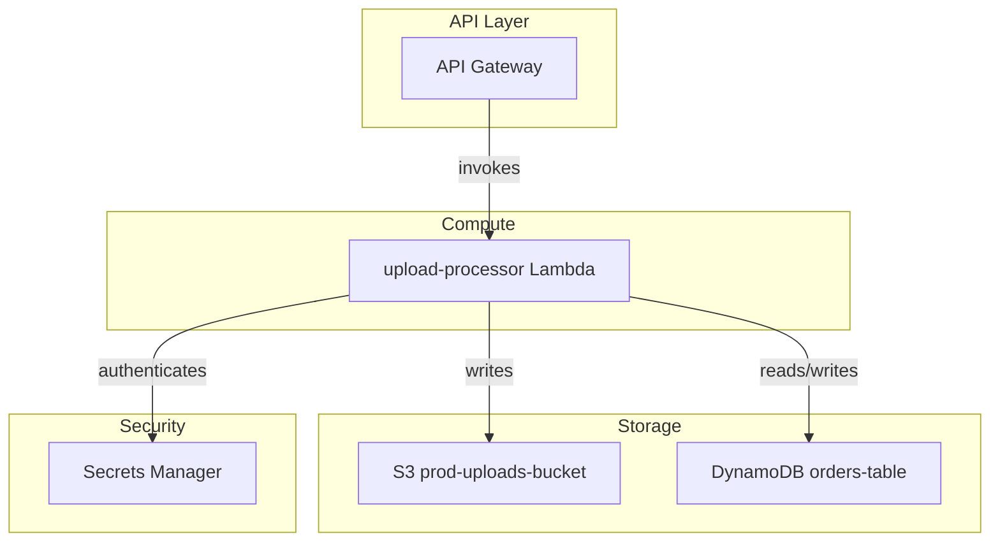

# AWS Inventory Scan Skill

## Purpose

Produce a complete, structured inventory of all AWS services used by the source application so downstream agents have accurate inputs for architecture design and code refactoring.

## When to Use

As the first action in Phase 1, before any other discovery work.

## Process

**Primary source: live AWS environment via AWS MCP Server.** Local files in `source-app/` are supplementary — use them to enrich Lambda source paths and confirm implicit SDK dependencies, not as a substitute for live data.

1. **Authenticate & orient** — Use the AWS MCP Server to call `sts:GetCallerIdentity` and obtain the AWS account ID and active regions. Record the account ID in `aws-inventory.json`.
2. **Live resource enumeration** — For each region, use the AWS MCP Server to enumerate all resources across every service category in the **AWS Services Catalogue** section. Use `resourcegroupstaggingapi:GetResources` first to get a broad tagged-resource baseline, then make service-specific API calls (e.g., `lambda:ListFunctions`, `s3:ListBuckets`, `dynamodb:ListTables`, `iam:ListRoles`, `apigateway:GetRestApis`, `cloudformation:DescribeStacks`) to fill in untagged resources and full configuration details.
3. **Supplement with local source** — Read `source-app/app-code/template.yaml` to cross-check deployed resource names, verify SAM/CloudFormation-declared resources are present in the live inventory, and catch any resources not yet deployed. Read Lambda source files under `source-app/app-code/lambda/` to identify implicit boto3 SDK calls that reveal service dependencies not declared in the template. Read `source-app/doc/` for architectural context.
4. **Capture attributes** — For each discovered resource, capture every attribute defined in the **Key Attributes** section using live API response data as the authoritative value.
5. **Map dependencies** — Use the live IAM role-to-resource bindings, environment variable references, and event source mappings returned by the AWS MCP Server to build the dependency graph. Supplement with boto3 call analysis from step 3.
6. **Write output files** — Write the four output files using the schemas in this skill.
7. **Run the Validation Checklist** before marking Phase 1 complete.

---

## AWS Services Catalogue

Scan ALL of the following service categories. This list is a minimum — also discover any unlisted resources present in the account or template.

**Compute:**
- AWS Lambda (functions, layers, event source mappings)
- Amazon ECS (clusters, services, task definitions)
- Amazon EKS (clusters, node groups, add-ons)
- Amazon EC2 (instances, AMIs, security groups, key pairs)
- AWS Elastic Beanstalk (environments, configurations)

**Storage:**
- Amazon S3 (buckets, versioning, lifecycle policies, replication rules)
- Amazon EBS (volumes, snapshots)
- Amazon Glacier / S3 Glacier (archives, vaults)

**Database:**
- Amazon RDS (instances, clusters, read replicas, parameter groups)
- Amazon DynamoDB (tables, GSIs, streams, TTL, backup policies)
- Amazon ElastiCache (clusters, replication groups, parameter groups)

**Networking:**
- Amazon VPC (VPCs, subnets, route tables, internet gateways, NAT gateways)
- AWS Direct Connect (connections, virtual interfaces)
- Amazon Route 53 (hosted zones, record sets)
- Elastic Load Balancing (ALB, NLB, Classic LB — listeners, target groups, rules)
- AWS VPN (customer gateways, virtual private gateways, VPN connections)

**Messaging & Events:**
- Amazon SQS (queues, FIFO queues, DLQs, visibility timeout, message retention)
- Amazon SNS (topics, subscriptions, delivery policies)
- Amazon EventBridge (event buses, rules, targets, schedules)
- AWS Kinesis (data streams, Firehose delivery streams, analytics applications)

**Security & Access:**
- AWS IAM (roles, policies, users, groups, permission boundaries)
- AWS Secrets Manager (secrets, rotation policies)
- AWS Systems Manager Parameter Store (parameters, SecureString entries)
- AWS KMS (keys, key policies, grants, aliases)
- AWS Certificate Manager (certificates, renewal status)

**Integration & API:**
- Amazon API Gateway (REST APIs, HTTP APIs, WebSocket APIs, stages, authorizers)
- AWS AppSync (GraphQL APIs, data sources, resolvers)
- AWS Step Functions (state machines, execution history)

**Monitoring & Logging:**
- Amazon CloudWatch (log groups, log retention, dashboards, alarms, metric filters)
- AWS CloudTrail (trails, S3 destination, event selectors)
- AWS X-Ray (sampling rules, groups, service maps)

**Infrastructure as Code:**
- AWS CloudFormation (stacks, stack sets, change sets, template bodies)
- AWS CDK (identify CDK-managed stacks via `aws:cdk:path` tag)

---

## Key Attributes

For EVERY discovered resource capture these attributes without exception:

| Attribute | Description |
|---|---|
| `identifier` | Full ARN, resource ID, and human-readable name |
| `type` | AWS service name + resource type (e.g., `lambda/function`) |
| `region` | AWS region(s) the resource exists in |
| `configuration` | Key settings and properties specific to that resource type |
| `tags` | All resource tags (cost allocation, compliance, ownership) |
| `dependencies` | Other resources this resource calls, reads from, or writes to |
| `used_by` | Resources that depend on this resource (reverse dependencies) |
| `criticality` | Business importance: `CRITICAL` / `HIGH` / `MEDIUM` / `LOW` |
| `compliance` | Compliance tags or requirements (PCI, HIPAA, SOC2) |
| `monthly_cost_usd` | Estimated monthly cost from Cost Explorer if available |
| `source_path` | For Lambda: path to source files under `source-app/` |

---

## References

### AWS Documentation

| Topic | Link |
|---|---|
| AWS Lambda developer guide | https://docs.aws.amazon.com/lambda/latest/dg/welcome.html |
| AWS SAM template specification | https://docs.aws.amazon.com/serverless-application-model/latest/developerguide/sam-specification.html |
| CloudFormation resource type reference | https://docs.aws.amazon.com/AWSCloudFormation/latest/UserGuide/aws-template-resource-type-ref.html |
| boto3 SDK reference | https://boto3.amazonaws.com/v1/documentation/api/latest/index.html |
| AWS Cost Explorer | https://docs.aws.amazon.com/cost-management/latest/userguide/ce-what-is.html |
| Amazon S3 developer guide | https://docs.aws.amazon.com/AmazonS3/latest/userguide/Welcome.html |
| Amazon DynamoDB developer guide | https://docs.aws.amazon.com/amazondynamodb/latest/developerguide/Introduction.html |
| Amazon EKS user guide | https://docs.aws.amazon.com/eks/latest/userguide/what-is-eks.html |
| Amazon EventBridge user guide | https://docs.aws.amazon.com/eventbridge/latest/userguide/eb-what-is.html |
| AWS IAM user guide | https://docs.aws.amazon.com/IAM/latest/UserGuide/introduction.html |
| AWS Secrets Manager user guide | https://docs.aws.amazon.com/secretsmanager/latest/userguide/intro.html |
| Amazon API Gateway developer guide | https://docs.aws.amazon.com/apigateway/latest/developerguide/welcome.html |

### Best Practices

- **Always scan implicit dependencies** — boto3 calls in Lambda code often reveal service usage not declared in CloudFormation/SAM templates.
- **Tag-based discovery:** Use `aws resourcegroupstaggingapi get-resources` to find all tagged resources across services before relying on template parsing alone.
- **Multi-region awareness:** Run inventory scans in every region the account is active in — not just `us-east-1`.
- **AWS Well-Architected Tool:** Cross-reference findings against the Well-Architected review at https://docs.aws.amazon.com/wellarchitected/latest/framework/welcome.html

For Lambda specifically also capture: `runtime`, `memory_mb`, `timeout_s`, `handler`, `environment_variables`, `layers`, `triggers`, `vpc_config`.
For RDS also capture: `engine`, `engine_version`, `instance_class`, `allocated_storage_gb`, `multi_az`, `backup_retention_days`, `encryption_enabled`.
For S3 also capture: `versioning_enabled`, `lifecycle_policies`, `public_access_blocked`, `replication_rules`.

---

## Dependency Analysis

### Dependency Types

**Direct** (resource A directly calls or uses B):
- Lambda → S3 (reads/writes objects)
- Lambda → RDS (database queries)
- Lambda → DynamoDB (item-level access)
- Lambda → Secrets Manager (credential fetch)
- API Gateway → Lambda (invocation)

**Indirect** (A uses B which uses C):
- Lambda → IAM Role → KMS Key
- EventBridge Rule → SNS Topic → SQS Queue → Lambda

**Network** (infrastructure-level relationships):
- EC2 Instance → VPC → Subnet → Route Table
- RDS Instance → DB Subnet Group → VPC
- EKS Cluster → VPC → Subnets → Security Groups

### Relationship Verb Vocabulary

Use exactly these verbs in the dependency matrix:

| Verb | Meaning |
|---|---|
| `reads` | Source reads data from target |
| `writes` | Source writes data to target |
| `queries` | Source queries target (database) |
| `calls` | Source invokes target (function/API) |
| `authenticates` | Source authenticates via target (IAM/Cognito) |
| `encrypts` | Source data encrypted by target (KMS) |
| `depends-on` | Generic dependency (use when none above fit) |
| `network` | Network-level dependency (VPC, subnet, SG) |

---

## Output Schemas

### 1. aws-inventory.json

```json
{
  "account_id": "123456789012",
  "region": "us-east-1",
  "discovery_timestamp": "2026-01-01T00:00:00Z",
  "summary": {
    "total_resources": 12,
    "service_count": 6,
    "estimated_complexity": "MEDIUM",
    "estimated_effort_weeks": 4
  },
  "services": {
    "lambda": {
      "count": 2,
      "resources": [
        {
          "arn": "arn:aws:lambda:us-east-1:123456789012:function:upload-processor",
          "name": "upload-processor",
          "runtime": "python3.11",
          "memory_mb": 512,
          "timeout_s": 30,
          "handler": "app.handler",
          "source_path": "source-app/app-code/lambda/upload/",
          "environment_variables": ["BUCKET_NAME", "TABLE_NAME"],
          "layers": [],
          "triggers": [{"source": "API Gateway", "event": "POST /upload"}],
          "vpc_config": {"subnet_ids": [], "security_group_ids": []},
          "dependencies": ["S3BucketUploads", "DynamoDBTable"],
          "tags": {"Environment": "production", "Application": "file-service"},
          "criticality": "HIGH",
          "monthly_cost_usd": 12.50,
          "iam_role": {
            "arn": "arn:aws:iam::123456789012:role/upload-processor-role",
            "permissions": {"s3": ["GetObject", "PutObject"], "dynamodb": ["GetItem", "PutItem"]}
          }
        }
      ]
    },
    "s3": {
      "count": 1,
      "resources": [
        {
          "arn": "arn:aws:s3:::prod-uploads-bucket",
          "name": "prod-uploads-bucket",
          "versioning_enabled": true,
          "public_access_blocked": true,
          "lifecycle_policies": [{"id": "move-to-cold", "transition_days": 90, "storage_class": "GLACIER"}],
          "encryption": {"type": "SSE-S3"},
          "dependencies": [],
          "used_by": ["upload-processor"],
          "criticality": "HIGH",
          "monthly_cost_usd": 8.00
        }
      ]
    },
    "dynamodb": {"count": 1, "resources": []},
    "apigateway": {"count": 1, "resources": []},
    "secretsmanager": {"count": 1, "resources": []}
  },
  "implicit_dependencies": [
    {
      "service": "AWS::SecretsManager::Secret",
      "note": "Referenced in lambda/upload/app.py via boto3 secretsmanager client — not declared in template.yaml"
    }
  ]
}
```

**JSON key naming rules:** snake_case for all keys. Lowercase service names (`lambda`, `rds`, `s3`). Boolean fields: `multi_az`, `encryption_enabled`, `versioning_enabled`.

### 2. architecture-diagram.mmd



Use `graph TB` or `graph TD`. Use `subgraph` for logical groups (API Layer, Compute, Storage, Database, Messaging, Security). Label every edge with the relationship verb.

### 3. dependency-matrix.csv

Column order (always include all columns):

```
Resource A, Type A, Region A, Resource B, Type B, Region B, Relationship, Criticality, Migration Order, Potential Issues, Notes
```

Sample rows:
```csv
Resource A,Type A,Region A,Resource B,Type B,Region B,Relationship,Criticality,Migration Order,Potential Issues,Notes
upload-processor,Lambda,us-east-1,prod-uploads-bucket,S3,us-east-1,writes,High,2,IAM permission mapping,File storage
upload-processor,Lambda,us-east-1,orders-table,DynamoDB,us-east-1,reads/writes,Critical,2,Change Feed vs streams,Order data
api-gateway,API Gateway,us-east-1,upload-processor,Lambda,us-east-1,calls,High,3,Auth mapping,HTTP integration
```

### 4. IAM Documentation (inline in aws-inventory.json)

For every Lambda, ECS task, or EC2 instance, include an `iam_role` block:

```json
{
  "iam_role": {
    "arn": "arn:aws:iam::123456789012:role/my-lambda-role",
    "permissions": {
      "s3": ["GetObject", "PutObject"],
      "dynamodb": ["GetItem", "PutItem", "Query"],
      "secretsmanager": ["GetSecretValue"]
    },
    "external_account_permissions": [],
    "cross_service_permissions": ["sns:Publish"]
  }
}
```

**Secrets rules:** Never capture actual secret values — only names, which resource accesses them, rotation policy, and whether encrypted with a CMK.

### Required Compliance Tags

Always capture and surface these tags if present:

| Tag Key | Values |
|---|---|
| `Environment` | development, staging, production |
| `Application` | service/component name |
| `Owner` | team or person responsible |
| `CostCenter` | cost allocation code |
| `Compliance` | PCI, HIPAA, SOC2, etc. |
| `DataClassification` | public, internal, confidential, restricted |

---

## Rules

- **Never modify anything in `source-app/`** — read only.
- **Never skip implicit dependencies** — scan Lambda source code for all boto3 client calls, revealing services not declared in the template.
- **Never omit the `implicit_dependencies` array** — even if empty, include it as `[]`.
- **Always include `source_path`** for every Lambda function so code-refactor can locate the source.
- **Never invent resource counts** — only report what is actually in the template or code.
- **All relationships must be bidirectional** — if A depends on B, B's `used_by` must include A.
- **Do NOT capture actual secret values** — names and metadata only.

---

## Validation Checklist

Before marking Phase 1 complete, every item below must pass:

### Completeness
- [ ] All AWS regions in template scanned
- [ ] All service categories checked (Compute, Storage, DB, Networking, Messaging, Security, Integration, Monitoring, IaC)
- [ ] No resources left in "Unknown" category
- [ ] All tags documented
- [ ] All configurations captured

### Accuracy
- [ ] All resource names match what is in the template (no invented names)
- [ ] All regions correct
- [ ] No duplicate resources in inventory
- [ ] All relationships are bidirectional

### Dependencies
- [ ] All forward dependencies documented
- [ ] All reverse dependencies documented
- [ ] Circular dependencies identified and flagged
- [ ] Critical path identified
- [ ] `implicit_dependencies` array populated from boto3 scan

### Output Quality
- [ ] `aws-inventory.json` is valid JSON (no syntax errors)
- [ ] `architecture-diagram.mmd` renders correctly in Mermaid (no syntax errors)
- [ ] `dependency-matrix.csv` has all 11 columns and at least one data row
- [ ] `migration-assessment.md` has `## Service Complexity Matrix` section

## Output

- `outputs/aws-migration-artifacts/aws-inventory.json` — valid JSON, non-empty
- `outputs/aws-migration-artifacts/architecture-diagram.mmd` — valid Mermaid syntax
- `outputs/aws-migration-artifacts/dependency-matrix.csv` — header + data rows
- `outputs/aws-migration-artifacts/migration-assessment.md` — see `migration-assessment` skill
