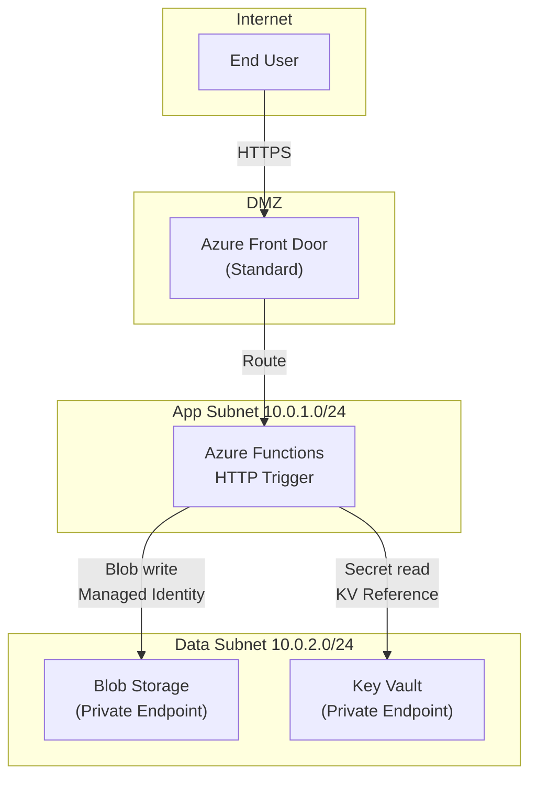

# Architecture Diagramming Skill

## Purpose

Produce a Mermaid diagram that accurately represents the target Azure deployment — every resource, every network boundary, and every connection labelled with protocol and auth method.

## When to Use

After `design-document.md` sections 3 and 4 are complete (all services selected and network topology defined).

## Process

1. Use `graph TD` (top-down) for most deployments; `graph LR` (left-right) if the data flow is strongly left-to-right.
2. Group resources into network boundaries using `subgraph` blocks:
   - `subgraph Internet["Internet"]`
   - `subgraph DMZ["DMZ / Front Door"]`
   - `subgraph AppSubnet["App Subnet (10.0.1.0/24)"]`
   - `subgraph DataSubnet["Data Subnet (10.0.2.0/24)"]`
3. Use descriptive node IDs with labels:
   ```
   FUNC_UPLOAD["Azure Functions\nUpload Handler\n(Consumption)"]
   STORAGE["Azure Blob Storage\nUploads Container"]
   KV["Azure Key Vault\nSecrets"]
   ```
4. Label all edges with the operation AND the auth method:
   ```
   FUNC_UPLOAD -->|"Blob write\n(Managed Identity)"| STORAGE
   FUNC_UPLOAD -->|"Secret read\n(Key Vault ref)"| KV
   USER -->|"HTTPS POST /upload"| FRONTDOOR
   FRONTDOOR -->|"Route to\nHTTP trigger"| FUNC_UPLOAD
   ```
5. Validate the diagram with the mermaid-diagram-validator tool before writing to file.
6. Write to `outputs/azure-architecture-output/architecture-diagram-azure.mmd`.

**Example structure:**


## Rules

- **Every resource in `design-document.md` Section 3 must appear in the diagram** — no omissions.
- **Every network boundary must be a `subgraph`** — resources not in a subgraph are assumed to be in a DMZ.
- **Every edge must have a label** showing at minimum the operation (read, write, invoke, route).
- **Every edge to a data service must show the auth method** (Managed Identity, Key Vault ref, etc.).
- **Always validate with mermaid-diagram-validator** before writing the final file.

## Output

`outputs/azure-architecture-output/architecture-diagram-azure.mmd` — valid Mermaid syntax that passes validator, with all resources and all edges labelled.

---

## References

### Microsoft / Azure Documentation

| Topic | Link |
|---|---|
| Azure architecture icons | https://learn.microsoft.com/en-us/azure/architecture/icons/ |
| Azure architecture diagrams guidance | https://learn.microsoft.com/en-us/azure/architecture/guide/design-principles/ |
| Azure Virtual Network topology | https://learn.microsoft.com/en-us/azure/virtual-network/virtual-networks-overview |
| Hub-spoke network topology | https://learn.microsoft.com/en-us/azure/architecture/networking/architecture/hub-spoke |
| Private endpoint network topology | https://learn.microsoft.com/en-us/azure/private-link/private-endpoint-overview |

### Mermaid Documentation

| Topic | Link |
|---|---|
| Mermaid graph diagrams | https://mermaid.js.org/syntax/flowchart.html |
| Mermaid subgraphs | https://mermaid.js.org/syntax/flowchart.html#subgraphs |
| Mermaid live editor (for validation) | https://mermaid.live |

### Best Practices

- **Validate with Mermaid live editor** before committing — syntax errors in `.mmd` files cause silent failures when the diagram is rendered in GitHub or the visualizer.
- **One subgraph per network boundary** — Internet, DMZ (Front Door/App Gateway), App Subnet, Data Subnet, and Management Subnet (if used).
- **Label every edge with auth method** — reviewers and auditors need to verify that no connection uses keys or passwords. Managed Identity must be visible on every edge to a data service.
- **Private endpoints must appear as distinct nodes**, not just implied — show `STORAGE_PE["Blob Storage\nPrivate Endpoint"]` inside the Data Subnet, connected to the storage account outside.
