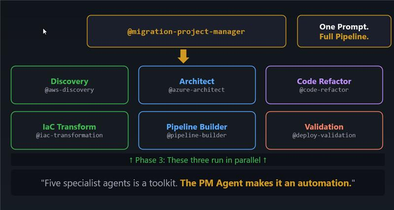
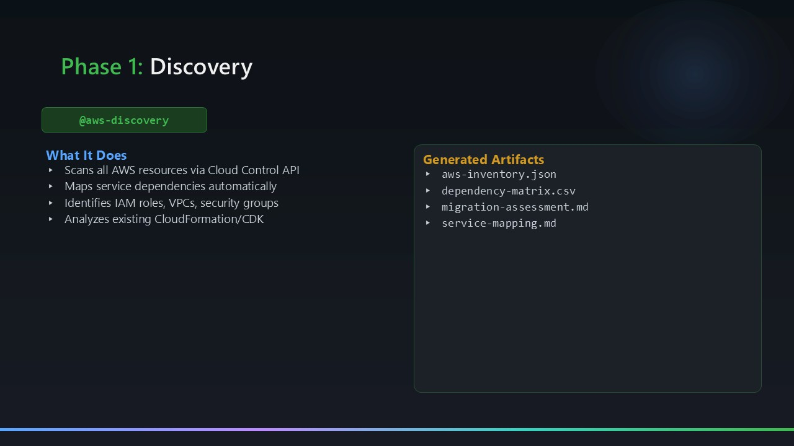
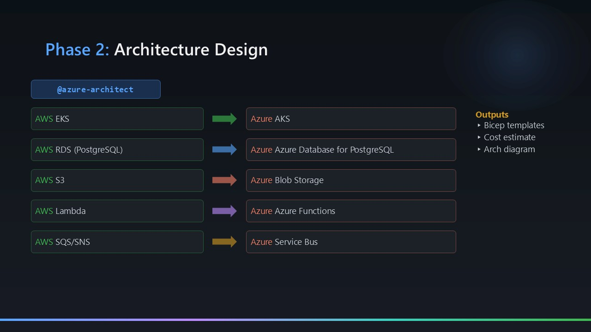
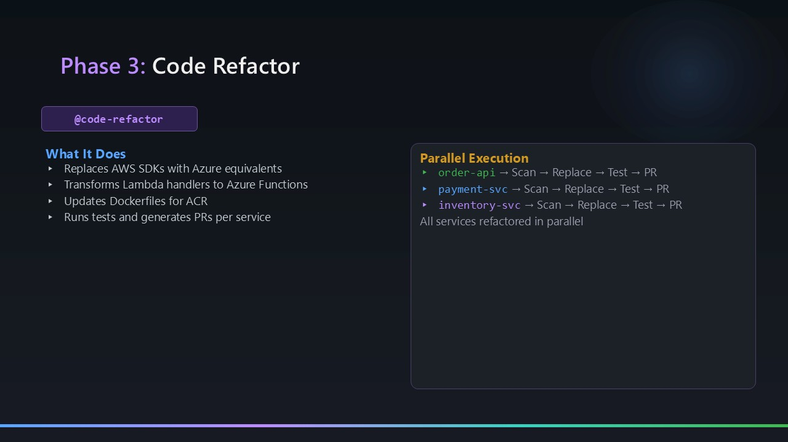
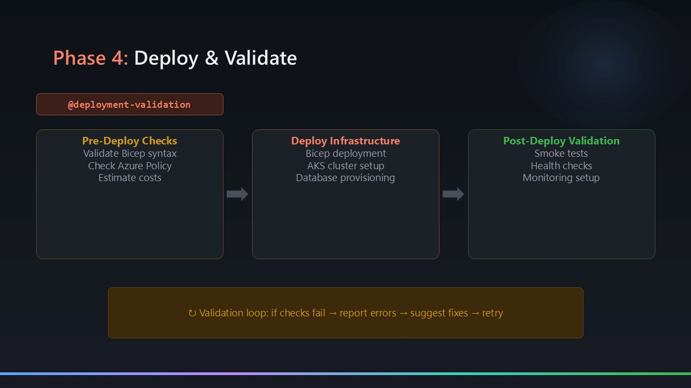
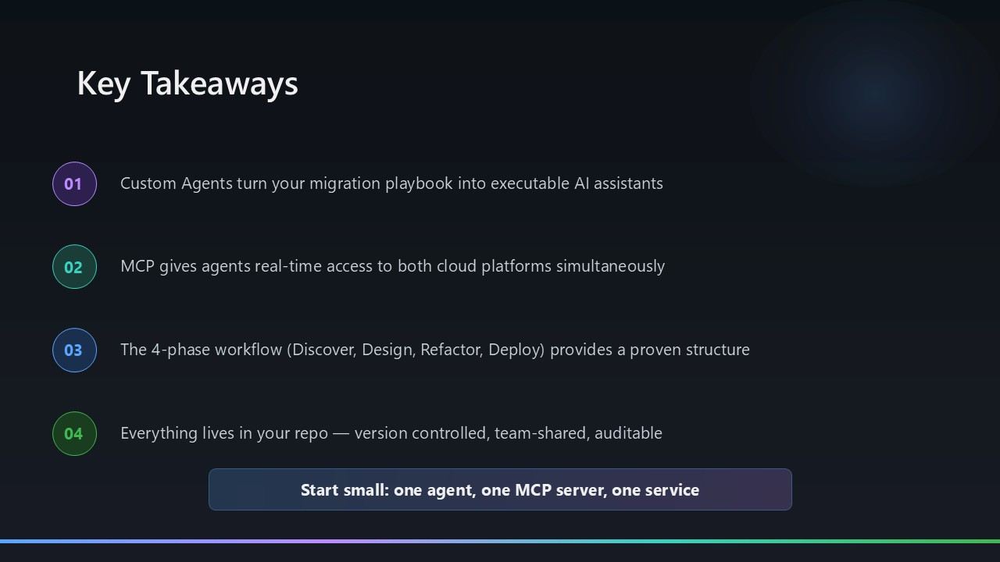

# AI-Assisted AWS to Azure Migration Framework

**Version:** 2.0  
**Date:** April 19, 2026

A framework of custom GitHub Copilot agents that automate the full AWS-to-Azure migration pipeline — from live account discovery through architecture design, code refactoring, IaC generation, CI/CD pipelines, and deployment validation.

---

## What's in This Repository

This repository contains the **agent definitions, instructions, and skills** that power the migration framework. The agents run entirely inside VS Code using GitHub Copilot's agent mode and MCP servers — no external tooling or scripts required.

A complete worked example (an image upload serverless app migrated from AWS account `535002891143`) lives in [`Sample-Migrations/`](Sample-Migrations/) along with all its generated outputs.

---

## Repository Structure

```
.github/
  agents/               # Eight custom GitHub Copilot agent definitions
    aws-discovery.agent.md
    aws-discovery-skills.agent.md
    azure-architect.agent.md
    code-refactor.agent.md
    iac-transformation.agent.md
    pipeline-builder-agent.agent.md
    deployment-validation.agent.md
    migration-project-manager.agent.md
  instructions/         # Per-agent instruction files
    discovery.instructions.md
    azure-architecture.instructions.md
    code-refactoring.instructions.md
    iac-transformation.instructions.md
    deployment-validation.instructions.md
  skills/               # Reusable AWS discovery skill (no MCP required)
    aws-discovery/SKILL.md
  workflows/            # GitHub Actions CI/CD pipelines (generated for each migration)
    deploy-infra.yml       # Bicep IaC deployment (subscription-scoped, OIDC)
    deploy-functions.yml   # Azure Functions build + zip deploy
    deploy-static-web.yml  # Azure Static Web Apps asset deployment
  COMPLETION-REPORT.md
  QUICK-START-GUIDE.md

visualizer/             # Migration Dashboard — live Vite web app
  src/
    main.js             # Reads migration-task-plan.md, renders phase status
    renderers.js        # Mermaid diagram + artifact file viewer
    style.css
  index.html
  package.json          # npm run dev / build / preview

Sample-Migrations/      # Full worked example — image upload service (AWS → Azure)
  app-code/             # Original AWS Lambda source + CloudFormation template
  outputs/              # All agent-generated artifacts
    aws-migration-artifacts/   # Discovery phase outputs
    azure-architecture-output/ # Architecture design phase outputs
    azure-functions/           # Refactored Python Azure Functions
    bicep-templates/           # Generated Bicep IaC (6 modules, 3 environments)
    migration-task-plan.md
    validation-report.md
  doc/                  # Extended documentation for the sample migration
```

---

## Quick Start

**Prerequisites:**
- VS Code with the GitHub Copilot extension
- AWS CLI configured with read access to the source account
- Azure CLI with Contributor access to the target subscription
- MCP servers configured (AWS Cloud Control API, AWS Knowledge, Microsoft Learn, Azure, Mermaid Chart)

**Running a migration:**

1. Open Copilot Chat (`Ctrl+Shift+I`) in VS Code
2. Use the **`@migration-project-manager`** agent to run all phases automatically:

```
@migration-project-manager Run the full migration pipeline for AWS account <your-account-id>
```

Or run individual phases in order:

| Step | Agent | Sample prompt |
|------|-------|---------------|
| 1 — Discovery | `@aws-discovery` | `Discover all resources in AWS account <id> and produce the inventory artifacts` |
| 2 — Architecture | `@azure-architect` | `Design Azure architecture based on the discovery outputs in outputs/aws-migration-artifacts/` |
| 3a — IaC | `@iac-transformation` | `Convert the CloudFormation template to Bicep using AVM modules` |
| 3b — Code | `@code-refactor` | `Refactor all Lambda functions to Azure Functions v2 (Python 3.11)` |
| 3c — Pipelines | `@pipeline-builder-agent` | `Create GitHub Actions CI/CD pipelines for infra, functions, and static web app` |
| 4 — Validation | `@deployment-validation` | `Validate all generated artifacts and produce a validation report` |

See [.github/QUICK-START-GUIDE.md](.github/QUICK-START-GUIDE.md) for detailed instructions.

---

## The Agents

All agents are defined in [`.github/agents/`](.github/agents/) and backed by instruction files in [`.github/instructions/`](.github/instructions/).



### `@migration-project-manager`
**File:** `.github/agents/migration-project-manager.agent.md`  
The orchestrator. Runs all phases in the correct dependency order (Discovery → Architecture → IaC + Code Refactor + Pipelines in parallel → Validation), verifies output artifacts after each phase, and maintains a live task plan at `outputs/migration-task-plan.md`.

### `@aws-discovery`
**File:** `.github/agents/aws-discovery.agent.md`  
Read-only discovery of all AWS resources using the AWS Cloud Control API MCP server — no CLI commands. Scans all enabled regions and produces:
- `outputs/aws-migration-artifacts/aws-inventory.json` — complete resource list with metadata
- `outputs/aws-migration-artifacts/architecture-diagram.mmd` — Mermaid diagram of the AWS topology
- `outputs/aws-migration-artifacts/dependency-matrix.csv` — service dependency relationships
- `outputs/aws-migration-artifacts/migration-assessment.md` — complexity ratings and effort estimates
- `outputs/aws-migration-artifacts/cloudformation-template.yaml` — captured stack template



### `@aws-discovery-skills`
**File:** `.github/agents/aws-discovery-skills.agent.md`  
Alternative discovery agent using the built-in AWS discovery skill (`SKILL.md`) rather than MCP servers. Useful when MCP access is unavailable or restricted.

### `@azure-architect`
**File:** `.github/agents/azure-architect.agent.md`  
Maps AWS services to Azure equivalents, produces a full architecture design document (11 sections), and generates Mermaid diagrams, service mapping tables, and cost comparisons using Microsoft Learn MCP. Outputs:
- `outputs/azure-architecture-output/design-document.md`
- `outputs/azure-architecture-output/architecture-diagram-azure.mmd`
- `outputs/azure-architecture-output/service-mapping.md`
- `outputs/azure-architecture-output/cost-comparison.md`



### `@iac-transformation`
**File:** `.github/agents/iac-transformation.agent.md`  
Converts AWS CloudFormation to modular Azure Bicep using AVM modules. Generates a subscription-scoped `main.bicep`, individual resource modules, and three environment parameter files (`dev`, `staging`, `prod`). Outputs write to `outputs/bicep-templates/`.

### `@code-refactor`
**File:** `.github/agents/code-refactor.agent.md`  
Rewrites Python Lambda handlers to Azure Functions v2 (decorator model). Replaces `boto3` with `azure-storage-blob` + `azure-identity`. Updates the frontend to remove AWS SDK dependencies. Outputs write to `outputs/azure-functions/` and `outputs/static-web-app/`.



### `@pipeline-builder-agent`
**File:** `.github/agents/pipeline-builder-agent.agent.md`  
Designs and builds GitHub Actions CI/CD pipelines for Azure deployment using OIDC / Workload Identity Federation (no long-lived credentials). Generates three workflows:
- `.github/workflows/deploy-infra.yml` — subscription-scoped Bicep IaC (what-if → deploy → smoke test)
- `.github/workflows/deploy-functions.yml` — Python 3.11, pip, zip deploy, rollback job on failure
- `.github/workflows/deploy-static-web.yml` — `Azure/static-web-apps-deploy@v1`, `skip_app_build: true`

### `@deployment-validation`
**File:** `.github/agents/deployment-validation.agent.md`  
Runs a 15-point static validation checklist across all generated artifacts: Bicep syntax, security posture, policy compliance, RBAC correctness, smoke test readiness, and AWS vs Azure functional parity. Outputs `outputs/validation-report.md`.



---

## The Visualizer

The `visualizer/` folder contains a live **Migration Dashboard** — a Vite-powered single-page app that shows the real-time status of any migration run.

### What it shows
- **Phase cards** with status badges (not started / in progress / completed)
- **Artifact file viewer** — opens any generated artifact (JSON, CSV, Markdown, Mermaid, YAML) directly in the browser
- **Mermaid diagram renderer** — renders `architecture-diagram.mmd` and `architecture-diagram-azure.mmd` side-by-side
- **30-second auto-refresh countdown** — polls `outputs/migration-task-plan.md` so the dashboard stays live as agents run

### How to run it

```bash
cd visualizer
npm install
npm run dev
```

The dashboard opens at `http://localhost:5173`. It reads `outputs/migration-task-plan.md` from the workspace root, so it works with any migration run — not just the sample.

```bash
npm run build    # build for static hosting
npm run preview  # preview the production build
```

---

## CI/CD Pipelines

The three generated GitHub Actions workflows under `.github/workflows/` are ready to use for any migration that produces the standard output folder structure.

| Workflow | Trigger | What it does |
|---|---|---|
| `deploy-infra.yml` | push to `main` (`bicep-templates/**`) or `workflow_dispatch` | `az deployment sub validate` → what-if → `az deployment sub create` |
| `deploy-functions.yml` | push to `main` (`azure-functions/**`) or `workflow_dispatch` | pip install, zip deploy, smoke test (expect 200/401/403), rollback on failure |
| `deploy-static-web.yml` | push to `main` (`static-web-app/**`) or `workflow_dispatch` | `Azure/static-web-apps-deploy@v1`, auto-creates `staticwebapp.config.json` if missing |

**Authentication:** OIDC / Workload Identity Federation — configure once per subscription, no secret rotation.

**Required GitHub Secrets:**

```
AZURE_CLIENT_ID          # service principal client ID
AZURE_TENANT_ID          # Azure AD tenant ID
AZURE_SUBSCRIPTION_ID    # target subscription
AZURE_RESOURCE_GROUP     # resource group name
AZURE_FUNCTION_APP_NAME  # function app resource name
STATIC_WEB_APP_TOKEN     # deployment token from Azure Portal
```

**Environment gates:** dev auto-deploys; staging requires 1 reviewer; prod requires 2 reviewers.

---

## Sample Migration

[`Sample-Migrations/`](Sample-Migrations/) contains a complete worked example: an AWS serverless **Image Upload Service** (4 Lambda functions + S3 + API Gateway + CloudFormation) migrated to Azure.

```
Sample-Migrations/
  app-code/           # Original AWS Lambda source (Python 3.11) + frontend + SAM template
  outputs/            # All artifacts produced by the agents during the migration run
    aws-migration-artifacts/    # Phase 1: Discovery
    azure-architecture-output/  # Phase 2: Architecture (APIM excluded — HTTP triggers only)
    azure-functions/            # Phase 3b: Refactored Python Azure Functions
    bicep-templates/            # Phase 3a: 6 Bicep modules + 3 parameter files
    migration-task-plan.md      # All phases ✅
    validation-report.md        # 15/15 checks PASSED
  doc/                # Extended documentation for this specific migration
```

Use the sample outputs as a reference when verifying what your own migration run should produce at each phase.

---

## Design Principles

**Agents operate through MCP servers, not CLI.** All agents use AWS and Azure MCP servers for resource discovery and documentation — no PowerShell or CLI commands inside agent workflows. This keeps agents portable and cross-platform.

**Managed Identity replaces IAM keys.** AWS IAM roles and access keys are replaced by Azure System-Assigned Managed Identity with fine-grained RBAC. No credentials in environment variables or code.

**Pre-signed URL pattern is preserved.** Clients upload/download directly to storage; the API generates short-lived SAS URLs. This maps cleanly from S3 pre-signed URLs to Azure Blob SAS tokens using user-delegation keys.

**Bicep is modular and AVM-aligned.** Generated templates use Azure Verified Modules where available, are subscription-scoped, and include environment-specific parameter files validated before deployment.

---

## Technology Stack

### MCP Servers

| MCP Server | Used by | Purpose |
|------------|---------|---------|
| AWS Cloud Control API MCP | `@aws-discovery` | Read-only AWS resource enumeration |
| AWS Knowledge MCP | `@aws-discovery`, `@azure-architect`, `@code-refactor` | AWS service documentation lookups |
| Microsoft Learn MCP | `@azure-architect`, `@iac-transformation`, `@code-refactor` | Azure docs and AVM module references |
| Azure MCP | `@azure-architect`, `@iac-transformation`, `@deployment-validation` | Live Azure resource information |
| Mermaid Chart MCP | `@azure-architect` | Diagram generation and syntax validation |

### Azure Runtime (generated output targets)
- **Azure Functions v4** — Python 3.11, Consumption plan, v2 decorator model
- **Azure Blob Storage** — Hot tier, Standard LRS (dev) / ZRS (prod), Managed Identity access
- **Azure Static Web Apps** — Free tier, `index.html` required as entry point
- **Application Insights + Log Analytics** — structured logging, distributed traces
- **Azure Key Vault** — Standard tier, soft-delete + purge protection enabled

---

## Known Gotchas

These issues were encountered during the first migration run and are now captured inside the relevant agent definitions so future runs avoid them automatically:

1. **Python version** — Azure Functions v4 supports Python 3.9–3.11 only. Python 3.12/3.13 crash the worker (`0xC0000005`). Always create the venv with Python 3.11: `python3.11 -m venv .venv`
2. **Reserved environment variable** — `CONTAINER_NAME` is reserved by the Azure Functions host. Use `BLOB_CONTAINER_NAME` for Blob Storage container references.
3. **Static Web Apps entry point** — Azure Static Web Apps requires `index.html` as the default file. A standalone `app.html` is not served as the root without a `staticwebapp.config.json` routing rule.
4. **SAS token generation** — Use `get_user_delegation_key()` from `BlobServiceClient` (Managed Identity path) rather than storage account keys.
5. **APIM is optional** — For simple Lambda + API Gateway → Azure Functions migrations, HTTP triggers are a direct equivalent. Add APIM only when gateway-layer features (rate limiting, request transformation, developer portal) are explicitly required.

---

## Requirements

**Tooling:**
- VS Code with GitHub Copilot extension (agent mode enabled)
- GitHub Copilot subscription
- MCP servers: AWS Cloud Control API, AWS Knowledge, Microsoft Learn, Azure, Mermaid Chart

**Permissions:**
- **AWS (source):** IAM `ReadOnlyAccess` policy minimum
- **Azure (target):** `Contributor` + `User Access Administrator` on the target subscription (required for RBAC module in Bicep)

---

## Key Takeaways


