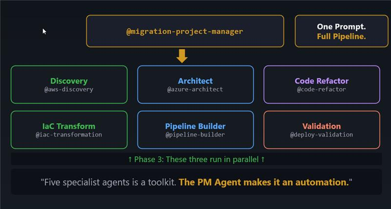
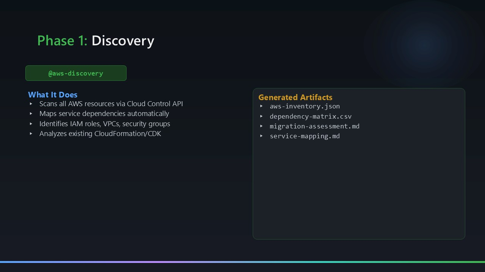
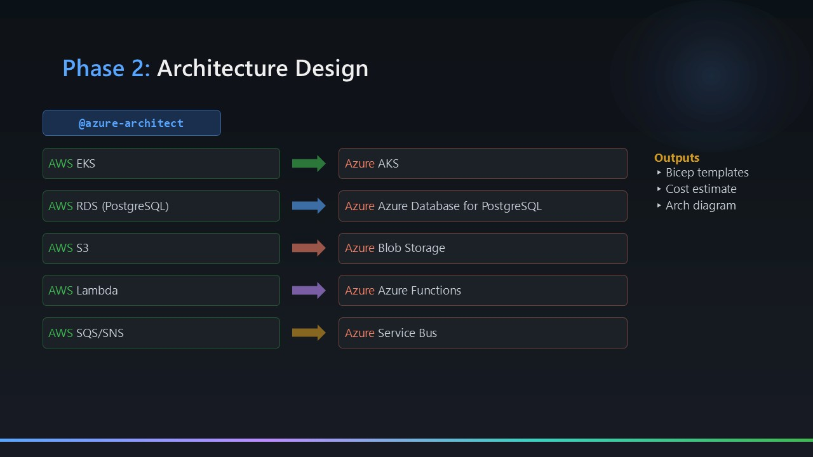
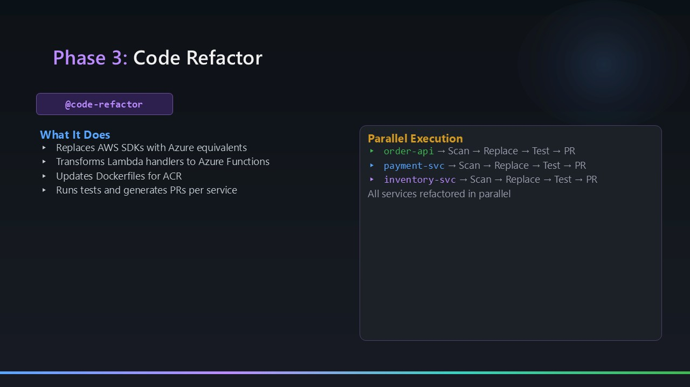
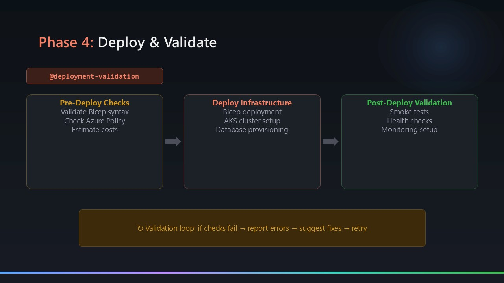
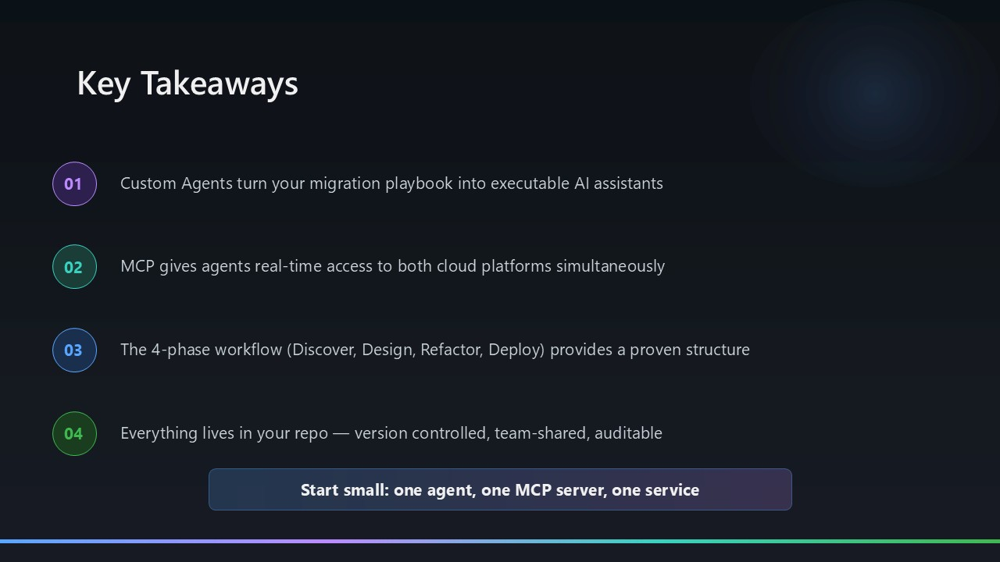

# AI-Assisted AWS to Azure Migration Factory

**Version:** 1.0.0 · [CHANGELOG](CHANGELOG.md) · [AGENTS.md](AGENTS.md)

A publishable plugin providing **10 specialist migration agents** and **22 skills** that orchestrate the full AWS-to-Azure migration pipeline — from live account discovery through architecture design, code refactoring, IaC generation, CI/CD pipelines, and deployment validation.

Installable as a plugin in Copilot CLI, Claude Code, and VS Code. All skill scripts run on macOS, Linux, WSL, and Windows (Bash + PowerShell 5.1 / 7+).

---

## Install

### Copilot CLI or Claude Code (recommended)
```
/plugin install azurewithdanidu/aws-to-azure-migrator
```

### Any agent runtime — latest `main`
```
npx skills add azurewithdanidu/aws-to-azure-migrator-skill
```

After installing, start a migration with:
```
/run-migration
```

---

## Quick Start (VS Code / Copilot Chat)

**Prerequisites:**
- VS Code with the GitHub Copilot extension (agent mode enabled)
- AWS CLI configured with read access to the source account
- Azure CLI with Contributor access to the target subscription
- MCP servers configured: AWS Cloud Control API · AWS Knowledge · Microsoft Learn · Azure · Mermaid Chart

**Option 1 — Slash command (recommended):**
```
/run-migration
```
The slash command guides you through supplying your AWS account ID and Azure subscription, then hands off to `@migration-project-manager` to run all phases automatically.

**Option 2 — Invoke the orchestrator directly:**
```
@migration-project-manager Run the full migration pipeline for AWS account <your-account-id>
```

**Option 3 — Run individual phases:**

| Step | Agent | Sample prompt |
|------|-------|---------------|
| 1 — Discovery | `@aws-discovery` | `Discover all resources in AWS account <id> and produce the inventory artifacts` |
| 2 — Architecture | `@azure-architect` | `Design Azure architecture based on the discovery outputs in outputs/aws-migration-artifacts/` |
| 3a — IaC | `@iac-transformation` | `Convert the CloudFormation template to Bicep using AVM modules` |
| 3b — Code | `@code-refactor` | `Refactor all Lambda functions to Azure Functions v2 (Python 3.11)` |
| 3c — Pipelines | `@pipeline-builder-agent` | `Create GitHub Actions CI/CD pipelines for infra, functions, and static web app` |
| 3d — Deploy | `@azure-deployer` | `Deploy the generated Bicep and Azure Functions to the target subscription` |
| 4 — Validation | `@deployment-validation` | `Validate all generated artifacts and produce a validation report` |

---

## Repository Structure

See [AGENTS.md](AGENTS.md) for the complete canonical reference. Summary:

```
.claude-plugin/
└── plugin.json             ← Canonical version source (semver). All release scripts read from here.

agents/                     ← USER-FACING PRODUCT. All 10 migration agents live here.
│                             Each agent is self-contained: instructions baked into the file.
├── migration-project-manager.agent.md   ← Orchestrator — invoke first
├── aws-discovery.agent.md               ← Phase 1
├── azure-architect.agent.md             ← Phase 2
├── iac-transformation.agent.md          ← Phase 3a (parallel)
├── code-refactor.agent.md               ← Phase 3b (parallel)
├── pipeline-builder-agent.agent.md      ← Phase 3c (parallel)
├── azure-deployer.agent.md              ← Phase 3d
├── deployment-validation.agent.md       ← Phase 4
├── skill-evolution-engine.agent.md      ← Meta: fix/improve existing skills
└── skill-generator-agent.md             ← Meta: create new skills

commands/
└── run-migration.md        ← /run-migration slash command. Primary user entry point.

skills/                     ← 22 skills across 8 agent categories.
├── aws-discovery/          2 skills  (aws-inventory-scan, migration-assessment)
├── azure-architect/        4 skills  (architecture-design, architecture-diagramming, cost-analysis, cost-estimator)
├── code-refactor/          2 skills  (lambda-to-functions, sdk-migration)
├── iac-transformation/     2 skills  (module-organization, parameter-management)
├── deployment-validation/  2 skills  (smoke-testing, what-if-validation)
├── pipeline-builder/       3 skills  (github-actions-oidc, multi-env-strategy, workflow-generation)
├── migration-pm/           2 skills  (orchestration, phase-delegation)
└── shared/                 5 skills  (aws-to-azure-mapping, azure-auth-patterns, azure-security-patterns,
                                       bicep-generation, task-tracking)

.github/
├── agents/                 CI-only agents (not shipped). PR reviewers, triage bots.
├── instructions/           Per-agent instruction overlays for VS Code agent mode.
├── workflows/              CI/CD: unit-tests, skill-security-scan, evals, release automation.
├── actions/                Composite actions (install-waza).
├── skills/                 Mirror of skills/ used by CI agents.
└── scripts/
    ├── release/            extract-version.sh · extract-changelog.sh · create-tag-and-release.sh
    ├── security/           run-skillspector-scan.sh · check-skillspector-threshold.sh
    └── test/               Install-Pester.ps1 · install-bats.sh

tests/
├── unit/                   Pester (.Tests.ps1) + bats (.bats) unit tests for all skill scripts
└── evals/                  Waza YAML evaluation task suites

visualizer/                 Migration Dashboard — Vite SPA. Not part of the plugin.
docs/                       Extended documentation and design specs.
```

---

## Migration Pipeline

```
/run-migration
      │
      ▼
migration-project-manager   ← Orchestrates all phases
      │
      ├─► Phase 1:  aws-discovery            → outputs/aws-migration-artifacts/
      │
      ├─► Phase 2:  azure-architect          → outputs/azure-architecture-output/
      │
      ├─► Phase 3a: iac-transformation       → outputs/bicep-templates/        ┐
      ├─► Phase 3b: code-refactor            → outputs/azure-functions/         ├─ parallel
      ├─► Phase 3c: pipeline-builder-agent   → .github/workflows/               ┘
      │
      ├─► Phase 3d: azure-deployer           → deploys to Azure
      │
      └─► Phase 4:  deployment-validation    → outputs/validation-report.md
```

---

## The Agents

All agents live in [`agents/`](agents/). Instructions are baked directly into each agent file — no separate instruction overlays needed for plugin users.



### `@migration-project-manager`
The orchestrator. Runs all phases in dependency order (Discovery → Architecture → IaC + Code Refactor + Pipelines in parallel → Deploy → Validation), verifies output artifacts after each phase, and maintains a live task plan at `outputs/migration-task-plan.md`.

### `@aws-discovery`
Read-only discovery of all AWS resources using the AWS Cloud Control API MCP server. Scans all enabled regions and produces:
- `outputs/aws-migration-artifacts/aws-inventory.json` — complete resource list with metadata
- `outputs/aws-migration-artifacts/architecture-diagram.mmd` — Mermaid diagram of the AWS topology
- `outputs/aws-migration-artifacts/dependency-matrix.csv` — service dependency relationships
- `outputs/aws-migration-artifacts/migration-assessment.md` — complexity ratings and effort estimates
- `outputs/aws-migration-artifacts/cloudformation-template.yaml` — captured stack template



### `@azure-architect`
Maps AWS services to Azure equivalents, produces a full architecture design document (11 sections), and generates Mermaid diagrams, service mapping tables, and cost comparisons using Microsoft Learn MCP. Outputs:
- `outputs/azure-architecture-output/design-document.md`
- `outputs/azure-architecture-output/architecture-diagram-azure.mmd`
- `outputs/azure-architecture-output/service-mapping.md`
- `outputs/azure-architecture-output/cost-comparison.md`



### `@iac-transformation`
Converts AWS CloudFormation to modular Azure Bicep using AVM modules. Generates a subscription-scoped `main.bicep`, individual resource modules, and three environment parameter files (`dev`, `staging`, `prod`). Outputs write to `outputs/bicep-templates/`.

### `@code-refactor`
Rewrites Python Lambda handlers to Azure Functions v2 (decorator model). Replaces `boto3` with `azure-storage-blob` + `azure-identity`. Updates the frontend to remove AWS SDK dependencies. Outputs write to `outputs/azure-functions/` and `outputs/static-web-app/`.



### `@pipeline-builder-agent`
Designs and builds GitHub Actions CI/CD pipelines for Azure deployment using OIDC / Workload Identity Federation (no long-lived credentials). Generates three workflows for infra, functions, and static web app deployments.

### `@azure-deployer`
Deploys generated Bicep templates and Azure Functions to the target subscription with three fallback strategies: Azure CLI → Azure PowerShell → Bicep direct. Verifies successful deployment via smoke tests.

### `@deployment-validation`
Runs a 15-point static validation checklist across all generated artifacts: Bicep syntax, security posture, policy compliance, RBAC correctness, smoke test readiness, and AWS vs Azure functional parity. Outputs `outputs/validation-report.md`.



### `@skill-evolution-engine`
Meta-agent. Diagnoses and fixes issues in existing skills — invoke when a skill produces incorrect output or is missing edge cases.

### `@skill-generator-agent`
Meta-agent. Creates new skill files and wires them into the correct agent. Invoke when a migration scenario needs a new capability not covered by existing skills.

---

## Skills

22 skills distributed across 8 agent categories. Each skill is a structured Markdown file with a description, usage pattern, and embedded cross-platform scripts where needed.

| Category | Skills |
|---|---|
| `aws-discovery` | aws-inventory-scan · migration-assessment |
| `azure-architect` | architecture-design · architecture-diagramming · cost-analysis · cost-estimator |
| `code-refactor` | lambda-to-functions · sdk-migration |
| `iac-transformation` | module-organization · parameter-management |
| `deployment-validation` | smoke-testing · what-if-validation |
| `pipeline-builder` | github-actions-oidc · multi-env-strategy · workflow-generation |
| `migration-pm` | orchestration · phase-delegation |
| `shared` | aws-to-azure-mapping · azure-auth-patterns · azure-security-patterns · bicep-generation · task-tracking |

All skills with scripts ship dual implementations:
- **`scripts/<name>.sh`** — Bash (macOS / Linux / WSL)
- **`scripts/<name>.ps1`** — PowerShell (pwsh 7+ recommended; `powershell.exe` 5.1 supported)

Runtime detection order: Bash (preferred) → `pwsh` → `powershell.exe`.

---

## Testing & Quality

### Unit Tests

Tests live in [`tests/unit/`](tests/unit/). Every skill script has both a Pester and a bats test file.

| Framework | Files | Run locally |
|---|---|---|
| bats (Bash) | `*.bats` | `bash tests/unit/run-bats-tests.sh` |
| Pester (PowerShell) | `*.Tests.ps1` | `pwsh tests/unit/Run-PesterTests.ps1` |

### SkillSpector Security Scan

All skill Markdown files are scanned by [NVIDIA SkillSpector](https://github.com/nvidia/skillspector) on every PR to `dev`. The scan checks for prompt injection, jailbreaking patterns, and capability over-claiming. PRs are blocked if the score falls below the configured threshold.

### Waza Evaluations

LLM-in-the-loop evaluations run via [Waza](https://github.com/microsoft/waza). Configuration is in [`.waza.yaml`](.waza.yaml); task suites live in [`tests/evals/`](tests/evals/).

---

## CI/CD (Repository Pipelines)

All PRs to `dev` must pass these checks before merging:

| Workflow | Trigger | What it does |
|---|---|---|
| `unit-tests.yml` | PR to `dev` | Runs bats + Pester unit tests across all skill scripts |
| `skill-security-scan.yml` | PR to `dev` | Runs SkillSpector scan; blocks on threshold failure |
| `skill-security-scan-upload.yml` | Push to `main` | Uploads SkillSpector results to GitHub Advanced Security |
| `eval.yml` | PR to `dev` | Runs Waza LLM mock evaluations |
| `create-release-pr.yml` | PR merge to `dev` (title: `version: `) | Auto-creates a `release: vX.Y.Z` PR from `dev → main` |
| `create-release.yml` | Release PR merge to `main` | Creates git tag + GitHub Release with CHANGELOG notes |

---

## Release Process

Releases are **fully automated**. To cut a new version:

1. Bump `"version"` in [`.claude-plugin/plugin.json`](.claude-plugin/plugin.json) (semver `X.Y.Z`).
2. Add a `## [X.Y.Z] - YYYY-MM-DD` section to [`CHANGELOG.md`](CHANGELOG.md).
3. Open a PR to `dev` with the title prefix `version: ` (e.g. `version: bump to 1.1.0`).
4. When the PR merges, `create-release-pr.yml` auto-creates a `release: vX.Y.Z` PR to `main`.
5. Approve and merge the release PR — `create-release.yml` tags and publishes the GitHub Release automatically.

> **Never** push directly to `main`, create tags manually, or create GitHub Releases by hand.

See [`CONTRIBUTING.md`](CONTRIBUTING.md) for the full contribution guide.

---

## Branch Protection Setup

| Branch | Rules |
|---|---|
| `main` | Require PR · 1 required reviewer · All status checks must pass · No direct pushes |
| `dev` | Require PR · All status checks must pass (`unit-tests`, `skill-security-scan`, `eval`) |

Required secrets for CI:

| Secret | Used by | Purpose |
|---|---|---|
| `COPILOT_GITHUB_TOKEN` | `eval.yml` | Fine-grained PAT with "Copilot Requests" permission for Waza |
| `GH_TOKEN` | Release workflows | PAT for creating PRs and GitHub Releases |

---

## The Visualizer

[`visualizer/`](visualizer/) contains a live **Migration Dashboard** — a Vite-powered single-page app that shows the real-time status of any migration run.

- **Phase cards** with status badges (not started / in progress / completed)
- **Artifact file viewer** — opens any generated artifact (JSON, CSV, Markdown, Mermaid, YAML) in the browser
- **Mermaid diagram renderer** — renders AWS and Azure architecture diagrams side-by-side
- **30-second auto-refresh** — polls `outputs/migration-task-plan.md` so the dashboard stays live

```bash
cd visualizer
npm install
npm run dev        # opens at http://localhost:5173
npm run build      # build for static hosting
```

---

## Sample Migration

[`Sample-Migrations/`](Sample-Migrations/) contains a complete worked example: an AWS serverless **Image Upload Service** (4 Lambda functions + S3 + API Gateway) migrated end-to-end to Azure.

```
Sample-Migrations/
  app-code/           # Original AWS Lambda source (Python 3.11) + frontend + SAM template
  outputs/
    aws-migration-artifacts/    # Phase 1: Discovery
    azure-architecture-output/  # Phase 2: Architecture
    azure-functions/            # Phase 3b: Refactored Azure Functions
    bicep-templates/            # Phase 3a: 6 Bicep modules + 3 parameter files
    migration-task-plan.md      # All phases ✅
    validation-report.md        # 15/15 checks PASSED
  doc/                # Extended documentation
```

---

## Design Principles

**Agents operate through MCP servers, not CLI.** All agents use AWS and Azure MCP servers for resource discovery and documentation — no hardcoded shell commands inside agent workflows. This keeps agents portable and cross-platform.

**Managed Identity replaces IAM keys.** AWS IAM roles and access keys are replaced by Azure System-Assigned Managed Identity with fine-grained RBAC. No credentials in environment variables or code.

**Pre-signed URL pattern is preserved.** Clients upload/download directly to storage; the API generates short-lived SAS URLs. This maps cleanly from S3 pre-signed URLs to Azure Blob SAS tokens using user-delegation keys.

**Bicep is modular and AVM-aligned.** Generated templates use Azure Verified Modules where available, are subscription-scoped, and include environment-specific parameter files validated before deployment.

**Dual-shell scripts everywhere.** Every skill script ships a `.sh` (Bash) and `.ps1` (PowerShell) implementation with identical output, so the plugin works on any developer machine.

---

## Technology Stack

### MCP Servers

| MCP Server | Used by | Purpose |
|---|---|---|
| AWS Cloud Control API MCP | `@aws-discovery` | Read-only AWS resource enumeration |
| AWS Knowledge MCP | `@aws-discovery`, `@azure-architect`, `@code-refactor` | AWS service documentation lookups |
| Microsoft Learn MCP | `@azure-architect`, `@iac-transformation`, `@code-refactor` | Azure docs and AVM module references |
| Azure MCP | `@azure-architect`, `@iac-transformation`, `@deployment-validation` | Live Azure resource information |
| Mermaid Chart MCP | `@azure-architect` | Diagram generation and syntax validation |

### Azure Runtime (generated output targets)
- **Azure Functions v4** — Python 3.11, Consumption plan, v2 decorator model
- **Azure Blob Storage** — Hot tier, Standard LRS (dev) / ZRS (prod), Managed Identity access
- **Azure Static Web Apps** — Free tier, `index.html` required as entry point
- **Application Insights + Log Analytics** — structured logging, distributed traces
- **Azure Key Vault** — Standard tier, soft-delete + purge protection enabled

---

## Known Gotchas

These issues were encountered during the first migration run and are captured inside the relevant agent definitions so future runs avoid them automatically:

1. **Python version** — Azure Functions v4 supports Python 3.9–3.11 only. Python 3.12/3.13 crash the worker (`0xC0000005`). Always create the venv with Python 3.11: `python3.11 -m venv .venv`
2. **Reserved environment variable** — `CONTAINER_NAME` is reserved by the Azure Functions host. Use `BLOB_CONTAINER_NAME` for Blob Storage container references.
3. **Static Web Apps entry point** — Azure Static Web Apps requires `index.html` as the default file. A standalone `app.html` is not served as the root without a `staticwebapp.config.json` routing rule.
4. **SAS token generation** — Use `get_user_delegation_key()` from `BlobServiceClient` (Managed Identity path) rather than storage account keys.
5. **APIM is optional** — For simple Lambda + API Gateway → Azure Functions migrations, HTTP triggers are a direct equivalent. Add APIM only when gateway-layer features (rate limiting, request transformation, developer portal) are explicitly required.

---

## Requirements

**Tooling:**
- VS Code with GitHub Copilot extension (agent mode enabled)
- GitHub Copilot subscription
- MCP servers: AWS Cloud Control API · AWS Knowledge · Microsoft Learn · Azure · Mermaid Chart
- Bash + `curl` + `jq`, or PowerShell 5.1+ (for skill scripts)

**Permissions:**
- **AWS (source):** IAM `ReadOnlyAccess` policy minimum
- **Azure (target):** `Contributor` + `User Access Administrator` on the target subscription (required for RBAC module in Bicep)

---

## Key Takeaways


