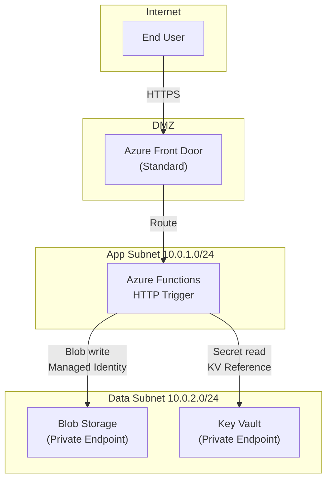

# Agent Skills Layer Implementation Plan

> **For agentic workers:** REQUIRED SUB-SKILL: Use superpowers:subagent-driven-development (recommended) or superpowers:executing-plans to implement this plan task-by-task. Steps use checkbox (`- [ ]`) syntax for tracking.

**Goal:** Add 21 IDE-agnostic pure-markdown skill files under `.github/skills/agents/` and update each of the 7 existing agent files to declare and delegate to those skills via a `## Skills` table.

**Architecture:** Skills are single-capability markdown files with two-line YAML frontmatter (`name` + `description`). Agents are thin orchestrators — each gains a `## Skills` table pointing to relevant skill files. The duplicated Task Status Reporting block (identical across all 6 worker agents) is replaced by a reference to `shared/task-tracking.md`. No existing agent file is renamed or relocated.

**Tech Stack:** Pure markdown, YAML frontmatter (2 lines per file), bash for validation

**Spec:** `docs/superpowers/specs/2026-06-21-agent-skills-layer-design.md`

---

## File Map

**Create (21 files):**
```
.github/skills/agents/shared/task-tracking.md
.github/skills/agents/shared/aws-to-azure-mapping.md
.github/skills/agents/shared/bicep-generation.md
.github/skills/agents/shared/azure-auth-patterns.md
.github/skills/agents/shared/azure-security-patterns.md
.github/skills/agents/migration-pm/orchestration.md
.github/skills/agents/migration-pm/phase-delegation.md
.github/skills/agents/aws-discovery/aws-inventory-scan.md
.github/skills/agents/aws-discovery/migration-assessment.md
.github/skills/agents/azure-architect/architecture-design.md
.github/skills/agents/azure-architect/cost-analysis.md
.github/skills/agents/azure-architect/architecture-diagramming.md
.github/skills/agents/code-refactor/lambda-to-functions.md
.github/skills/agents/code-refactor/sdk-migration.md
.github/skills/agents/iac-transformation/module-organization.md
.github/skills/agents/iac-transformation/parameter-management.md
.github/skills/agents/deployment-validation/what-if-validation.md
.github/skills/agents/deployment-validation/smoke-testing.md
.github/skills/agents/pipeline-builder/github-actions-oidc.md
.github/skills/agents/pipeline-builder/multi-env-strategy.md
.github/skills/agents/pipeline-builder/workflow-generation.md
```

**Modify (7 files):**
```
.github/agents/migration-project-manager.agent.md  — add ## Skills, replace Task Status Reporting
.github/agents/aws-discovery.agent.md              — add ## Skills, replace Task Status Reporting
.github/agents/azure-architect.agent.md            — add ## Skills, replace Task Status Reporting
.github/agents/code-refactor.agent.md              — add ## Skills, replace Task Status Reporting
.github/agents/iac-transformation.agent.md         — add ## Skills, replace Task Status Reporting
.github/agents/deployment-validation.agent.md      — add ## Skills, replace Task Status Reporting
.github/agents/pipeline-builder-agent.agent.md     — add ## Skills, replace Task Status Reporting
```

---

## Task 1: Create folder structure

**Files:** Create directory tree under `.github/skills/agents/`

- [ ] **Step 1: Create all subdirectories**

```bash
mkdir -p .github/skills/agents/shared
mkdir -p .github/skills/agents/migration-pm
mkdir -p .github/skills/agents/aws-discovery
mkdir -p .github/skills/agents/azure-architect
mkdir -p .github/skills/agents/code-refactor
mkdir -p .github/skills/agents/iac-transformation
mkdir -p .github/skills/agents/deployment-validation
mkdir -p .github/skills/agents/pipeline-builder
```

- [ ] **Step 2: Verify structure**

```bash
find .github/skills/agents -type d | sort
```

Expected output:
```
.github/skills/agents
.github/skills/agents/aws-discovery
.github/skills/agents/azure-architect
.github/skills/agents/code-refactor
.github/skills/agents/deployment-validation
.github/skills/agents/iac-transformation
.github/skills/agents/migration-pm
.github/skills/agents/pipeline-builder
.github/skills/agents/shared
```

- [ ] **Step 3: Commit**

```bash
git add .github/skills/agents/
git commit -m "chore: scaffold agent skills directory structure"
```

---

## Task 2: Create `shared/task-tracking.md`

**Files:**
- Create: `.github/skills/agents/shared/task-tracking.md`

- [ ] **Step 1: Create the file**

```bash
cat > .github/skills/agents/shared/task-tracking.md << 'EOF'
---
name: task-tracking
description: Keep outputs/migration-task-plan.md synchronized with real agent progress — status symbols, update rules, and blocker format
---

# Task Tracking Skill

## Purpose

Keep `outputs/migration-task-plan.md` synchronized with actual agent progress so the migration PM and the user always have an accurate live view of pipeline state.

## When to Use

- At the very start of your assigned phase (before any work begins)
- Each time you complete an individual task within your phase
- When your phase completes successfully
- When you hit a blocker or failure

## Process

**On start (before any work):**
1. Read `outputs/migration-task-plan.md`.
2. Find your phase row in the Phase Summary table.
3. Change the status cell from `⏳` to `🔄`.
4. Update the `Last Updated:` timestamp at the top of the file to the current ISO 8601 UTC timestamp.

**As each task within your phase completes:**
1. Find the specific `- [ ]` checkbox line in your phase section.
2. Change `- [ ]` to `- [x]` and append ` — completed <ISO 8601 UTC timestamp>`.
3. Do this incrementally after each task finishes — never batch all updates at the end.
4. Update `Last Updated:` timestamp on every edit.

**On successful completion of all phase tasks:**
1. Set your phase row status to `✅`.
2. Fill in the `Completed At` column with the current ISO 8601 UTC timestamp.
3. Update `Last Updated:` timestamp.

**On failure or blocker:**
1. Set your phase row status to `❌`.
2. Add a bullet under the `## Blockers` section in exactly this format:
   `- Phase <N> (<agent-name>): <what failed> — <what is needed to unblock>`
3. Stop work and surface the blocker clearly in your response to the user.

## Rules

- **Never modify task rows belonging to other phases.** If phases 3a, 3b, 3c run in parallel, each touches only its own rows.
- **Never mark a task `[x]` unless its output artifact actually exists and is non-empty.** Existence check: read the file or verify it via the file system before marking complete.
- **Always use only these status symbols:** `⏳` (not started) `🔄` (in progress) `✅` (complete) `❌` (failed/blocked).
- **Always re-read the file before each edit** to avoid overwriting concurrent updates from other agents running in parallel.
- **Never revert a `❌` status to `✅`** without re-running the phase and confirming artifacts exist.

## Output

Updated `outputs/migration-task-plan.md` with:
- Phase Summary table row reflecting current status
- Individual task checkboxes checked with timestamps
- Blockers section populated if applicable
- `Last Updated:` timestamp current
EOF
```

- [ ] **Step 2: Verify structure**

```bash
grep "^name:" .github/skills/agents/shared/task-tracking.md
grep "^## " .github/skills/agents/shared/task-tracking.md | wc -l
grep -iE "tools:|applyTo:|vscode|copilot" .github/skills/agents/shared/task-tracking.md
```

Expected: name line present, section count ≥ 5, IDE content grep returns nothing.

- [ ] **Step 3: Commit**

```bash
git add .github/skills/agents/shared/task-tracking.md
git commit -m "feat: add shared/task-tracking skill"
```

---

## Task 3: Create `shared/aws-to-azure-mapping.md`

**Files:**
- Create: `.github/skills/agents/shared/aws-to-azure-mapping.md`

- [ ] **Step 1: Create the file**

```bash
cat > .github/skills/agents/shared/aws-to-azure-mapping.md << 'EOF'
---
name: aws-to-azure-mapping
description: Authoritative AWS-to-Azure service equivalents for all service categories — compute, storage, database, messaging, networking, security, monitoring
---

# AWS-to-Azure Mapping Skill

## Purpose

Provide the authoritative mapping from every AWS service encountered in this migration to its Azure equivalent, including configuration differences and migration notes.

## When to Use

- Before selecting any Azure service as a replacement for an AWS service
- When populating `service-mapping.md` or `design-document.md` Section 3
- When specifying code or IaC changes that reference service-specific APIs or SDKs

## Process

1. Identify each AWS service from `outputs/aws-migration-artifacts/aws-inventory.json`.
2. Look up the Azure equivalent in the mapping tables below.
3. Note the configuration differences and migration considerations for each.
4. For any AWS service not in the tables, use `azure-mcp/documentation` to find the equivalent and cite the source in the design document under "Open Questions / Gaps".
5. Apply the service selection priority rule: **serverless-first** — prefer Azure Functions over Container Apps over AKS unless the workload requires containers or persistent state.

## Mapping Tables

### Compute

| AWS Service | Azure Equivalent | Key Differences |
|---|---|---|
| Lambda | Azure Functions | Consumption/Premium/Dedicated plans; Python handler signature differs (`func.HttpRequest` not `event`/`context`) |
| ECS / Fargate | Azure Container Apps | KEDA-based scaling; Dapr integration; no task definition concept |
| EKS | Azure Kubernetes Service (AKS) | Azure AD RBAC; Azure CNI networking; managed node pools |
| EC2 | Azure Virtual Machines | Availability Zones; Spot VMs (up to 90% savings); proximity placement groups |
| Elastic Beanstalk | Azure App Service | Deployment slots; auto-scale rules |
| Batch | Azure Batch | Pool and job concepts align; node agent differs |

### Storage

| AWS Service | Azure Equivalent | Key Differences |
|---|---|---|
| S3 | Azure Blob Storage | SAS tokens vs presigned URLs; Hot/Cool/Archive tiers; lifecycle policies |
| EFS | Azure Files | SMB 3.x / NFS 4.1; Premium (SSD) and Standard (HDD) tiers |
| FSx for Windows | Azure Files (Premium SMB) | Full SMB protocol; Active Directory integration |
| ECR | Azure Container Registry (ACR) | Basic/Standard/Premium SKUs; geo-replication in Premium |
| Glacier | Azure Blob Archive tier | Retrieval latency: Standard (hours), Expedited (minutes) |

### Database

| AWS Service | Azure Equivalent | Key Differences |
|---|---|---|
| RDS PostgreSQL | Azure Database for PostgreSQL Flexible Server | Burstable (B-series) / GP / Memory Optimized SKUs; Entra auth supported |
| RDS MySQL | Azure Database for MySQL Flexible Server | Same SKU pattern; HA with zone-redundant standby |
| DynamoDB | Azure Cosmos DB (NoSQL API) | Request Unit (RU) provisioning; partition key required; also MongoDB/Cassandra/Table API |
| ElastiCache Redis | Azure Cache for Redis | Basic/Standard/Premium tiers; clustering in Premium |
| Aurora | Azure SQL Database Hyperscale | Auto-scaling storage; read replicas |
| RDS SQL Server | Azure SQL Managed Instance | Full SQL Server compatibility; VNet-injected |

### Messaging

| AWS Service | Azure Equivalent | Key Differences |
|---|---|---|
| SQS | Azure Service Bus Queue | Sessions for FIFO; dead-letter queue; message lock duration (max 5 min) |
| SNS | Azure Event Grid | Push model; topic/subscription; event schema filtering |
| EventBridge | Azure Event Grid (Custom Topics) | Event routing rules; domain routing for multi-tenant |
| Kinesis Data Streams | Azure Event Hubs | Consumer groups; Kafka protocol compatibility in Standard+ |
| Kinesis Firehose | Azure Event Hubs + Stream Analytics | Delivery to Blob, ADLS, SQL |
| SQS FIFO | Azure Service Bus Queue (Sessions enabled) | Sessions guarantee ordering per session key |

### Networking

| AWS Service | Azure Equivalent | Key Differences |
|---|---|---|
| VPC | Azure Virtual Network (VNet) | Address space; subnet delegation; no implicit default VPC |
| Security Groups | Network Security Groups (NSGs) | Stateful; ASG equivalent = Application Security Groups |
| VPC Peering | VNet Peering | Non-transitive; Global VNet Peering across regions |
| Transit Gateway | Azure Virtual WAN | Hub-spoke topology; SD-WAN integration |
| ALB | Azure Application Gateway | WAF v2 integration; URL-based routing; multi-site hosting |
| NLB | Azure Load Balancer (Standard) | Standard SKU required for Availability Zone support |
| CloudFront | Azure Front Door | Premium for WAF; Standard for CDN; anycast PoPs |
| Route 53 (DNS) | Azure DNS | Private DNS Zones for VNet resolution |
| Route 53 (Routing) | Azure Traffic Manager | Weighted/Priority/Performance routing policies |
| Direct Connect | Azure ExpressRoute | Partner circuits; FastPath for high-throughput |
| VPN Gateway | Azure VPN Gateway | Route-based; active-active for HA |

### Security & Identity

| AWS Service | Azure Equivalent | Key Differences |
|---|---|---|
| IAM Roles | Azure Managed Identity + RBAC | System-assigned (per resource) or User-assigned (shared); built-in roles |
| IAM Policies | Azure RBAC Role Definitions | JSON conditions; scope = management group/subscription/RG/resource |
| Secrets Manager | Azure Key Vault (Secrets) | Soft delete enabled by default; purge protection recommended |
| KMS | Azure Key Vault (Keys) | HSM-backed keys in Premium SKU |
| ACM | App Service Managed Certs / Key Vault Certs | Free managed certs for App Service; Key Vault for custom |
| WAF | Azure Web Application Firewall | Integrated with App Gateway or Front Door |
| Cognito | Azure Active Directory B2C | User flows (built-in) and custom policies (Identity Experience Framework) |
| Shield | Azure DDoS Protection | Basic (free, always-on); Standard (per-VNet, $2944/month) |
| GuardDuty | Microsoft Defender for Cloud | Security posture + threat protection |
| Macie | Microsoft Purview | Data governance and sensitive data discovery |

### Monitoring & Operations

| AWS Service | Azure Equivalent | Key Differences |
|---|---|---|
| CloudWatch Logs | Azure Monitor Logs (Log Analytics) | KQL query language (not CloudWatch Insights) |
| CloudWatch Metrics | Azure Monitor Metrics | Custom metrics via App Insights SDK |
| X-Ray | Azure Application Insights | Distributed tracing; dependency maps; sampling |
| CloudTrail | Azure Monitor Activity Log | 90-day retention by default; archive to Storage |
| Systems Manager | Azure Automation | Runbooks (PowerShell/Python); DSC; patch management |
| Systems Manager Parameter Store | Azure App Configuration | Hierarchical keys; feature flags |
| CloudFormation | Azure Bicep / ARM | Bicep is preferred (transpiles to ARM) |
| CDK | Azure Developer CLI (azd) | Scaffold + provision + deploy |

## Rules

- **Never pick AKS** for a workload that fits Azure Container Apps (stateless, HTTP-driven, KEDA-scalable).
- **Never use Azure API Management** as the primary ingress router — prohibited by this project's design constraints.
- **Always default to single-region** unless `migration-assessment.md` explicitly flags multi-region requirements.
- **Serverless-first:** Functions → Container Apps → AKS. Document the reason if deviating from this order.
- **For any service not in these tables**, document it as a gap in `design-document.md` Section 11 "Open Questions" and look it up via `azure-mcp/documentation`.

## Output

- Populated rows in `outputs/azure-architecture-output/design-document.md` Section 3 (Azure Service Mapping table)
- Populated `outputs/azure-architecture-output/service-mapping.md`
- Any gaps documented under "Open Questions / Gaps" in the design document
EOF
```

- [ ] **Step 2: Verify**

```bash
grep "^name:" .github/skills/agents/shared/aws-to-azure-mapping.md
grep "^## " .github/skills/agents/shared/aws-to-azure-mapping.md | wc -l
grep -iE "tools:|applyTo:|vscode|copilot" .github/skills/agents/shared/aws-to-azure-mapping.md
```

Expected: name present, ≥ 5 sections, no IDE content.

- [ ] **Step 3: Commit**

```bash
git add .github/skills/agents/shared/aws-to-azure-mapping.md
git commit -m "feat: add shared/aws-to-azure-mapping skill"
```

---

## Task 4: Create `shared/bicep-generation.md`

**Files:**
- Create: `.github/skills/agents/shared/bicep-generation.md`

- [ ] **Step 1: Create the file**

```bash
cat > .github/skills/agents/shared/bicep-generation.md << 'EOF'
---
name: bicep-generation
description: Write secure, modular, deployable Bicep IaC — naming conventions, decorators, module structure, outputs, and validation steps
---

# Bicep Generation Skill

## Purpose

Produce valid, secure, and maintainable Azure Bicep templates that follow Azure best practices, pass `az bicep build` without errors, and can be deployed safely across dev/staging/prod environments.

## When to Use

- When specifying Bicep module structure in `design-document.md` Section 5 (azure-architect)
- When implementing Bicep files from the design document (iac-transformation)
- When reviewing or modifying any existing `.bicep` or `.bicepparam` file

## Process

1. **Naming:** Use `'${environment}-${workload}-<type>-${location}'` for most resources. For storage accounts (24-char limit, no hyphens): `'${environment}${workload}stor${uniqueSuffix}'`. Use `uniqueString(resourceGroup().id)` for the suffix.

2. **Parameters:** Decorate every parameter:
   ```bicep
   @minLength(3)
   @maxLength(24)
   @description('Name of the storage account. Must be globally unique.')
   param storageAccountName string

   @allowed(['dev', 'staging', 'prod'])
   @description('Deployment environment.')
   param environment string

   @minValue(1)
   @maxValue(10)
   @description('Number of instances.')
   param instanceCount int = 1
   ```

3. **Variables:** Compute derived names in variables — never inline:
   ```bicep
   var functionAppName = '${environment}-${workload}-func-${location}'
   var storageAccountName = toLower('${environment}${workload}stor${uniqueSuffix}')
   var uniqueSuffix = uniqueString(resourceGroup().id)
   ```

4. **Modules:** Each module has one responsibility (networking, storage, compute, security, monitoring). Keep modules under ~150 lines. Root `main.bicep` only declares parameters and module calls — no direct resources.

5. **Outputs:** Every module must output:
   - `resourceId` — the full resource ID
   - `resourceName` — the resource name
   - `principalId` — if the resource has a managed identity
   - `endpoint` or `fqdn` — for services accessed over the network

6. **Tags:** Apply a `tags` object to every resource:
   ```bicep
   param tags object = {
     environment: environment
     workload: workload
     managedBy: 'bicep'
   }
   ```

7. **Validate before declaring done:**
   ```bash
   az bicep build --file main.bicep
   az deployment group what-if \
     --resource-group <rg> \
     --template-file main.bicep \
     --parameters @parameters/dev.bicepparam
   ```

## Rules

- **Never hardcode secrets, passwords, or connection strings.** Use `@secure()` for sensitive parameters; reference Key Vault secrets via `@Microsoft.KeyVault(SecretUri=...)`.
- **Never set `publicNetworkAccess: 'Enabled'` on data services** (Storage, Key Vault, Service Bus, databases). Always `'Disabled'` with a private endpoint.
- **Never use access keys for service-to-service auth.** Always Managed Identity + RBAC role assignments (see `azure-auth-patterns` skill).
- **Always pin API versions** — never use `@latest` or omit the version. Example: `'Microsoft.Storage/storageAccounts@2023-01-01'`.
- **Never create a module that exceeds ~150 lines** — split it if it grows beyond that.
- **Always run `az bicep build`** before declaring any Bicep file complete. A file that does not build is not done.

## Output

- Valid `.bicep` files under `outputs/bicep-templates/` with zero build errors
- `.bicepparam` files under `outputs/bicep-templates/parameters/` for each environment (dev, staging, prod)
- `az bicep build` exits with code 0 for every file
- `az deployment group what-if` produces no blocking errors
EOF
```

- [ ] **Step 2: Verify**

```bash
grep "^name:" .github/skills/agents/shared/bicep-generation.md
grep "^## " .github/skills/agents/shared/bicep-generation.md | wc -l
grep -iE "tools:|applyTo:|vscode|copilot" .github/skills/agents/shared/bicep-generation.md
```

- [ ] **Step 3: Commit**

```bash
git add .github/skills/agents/shared/bicep-generation.md
git commit -m "feat: add shared/bicep-generation skill"
```

---

## Task 5: Create `shared/azure-auth-patterns.md`

**Files:**
- Create: `.github/skills/agents/shared/azure-auth-patterns.md`

- [ ] **Step 1: Create the file**

```bash
cat > .github/skills/agents/shared/azure-auth-patterns.md << 'EOF'
---
name: azure-auth-patterns
description: Authenticate Azure services to each other using Managed Identity and RBAC — never connection strings or access keys
---

# Azure Auth Patterns Skill

## Purpose

Replace all AWS IAM-based authentication patterns with Azure Managed Identity and RBAC, ensuring no long-lived credentials appear in code, environment variables, or configuration files.

## When to Use

- When rewriting Lambda handlers that call AWS services (boto3 clients) into Azure Function equivalents
- When writing Bicep RBAC role assignments
- When configuring app settings that reference downstream services
- Any time a service needs to authenticate to another Azure service

## Process

**In Bicep (infrastructure):**

1. Enable system-assigned managed identity on every compute resource:
   ```bicep
   resource functionApp 'Microsoft.Web/sites@2023-01-01' = {
     identity: {
       type: 'SystemAssigned'
     }
     // ...
   }
   ```

2. Assign the minimum required RBAC role to the principal ID:
   ```bicep
   resource blobAccess 'Microsoft.Authorization/roleAssignments@2022-04-01' = {
     scope: storageAccount
     name: guid(resourceGroup().id, functionApp.id, 'blob-contributor')
     properties: {
       roleDefinitionId: subscriptionResourceId(
         'Microsoft.Authorization/roleDefinitions',
         'ba92f5b4-2d11-453d-a403-e96b0029c9fe'  // Storage Blob Data Contributor
       )
       principalId: functionApp.identity.principalId
       principalType: 'ServicePrincipal'
     }
   }
   ```

3. Reference Key Vault secrets in app settings — no SDK call needed at runtime:
   ```bicep
   resource appSettings 'Microsoft.Web/sites/config@2023-01-01' = {
     name: '${functionApp.name}/appsettings'
     properties: {
       'MY_SECRET': '@Microsoft.KeyVault(SecretUri=https://${keyVaultName}.vault.azure.net/secrets/MySecret/)'
     }
   }
   ```

**In Python (application code):**

4. Replace all boto3 clients with `DefaultAzureCredential`:
   ```python
   from azure.identity import DefaultAzureCredential
   from azure.storage.blob import BlobServiceClient

   credential = DefaultAzureCredential()
   blob_client = BlobServiceClient(
       account_url=f"https://{os.environ['STORAGE_ACCOUNT_NAME']}.blob.core.windows.net",
       credential=credential
   )
   ```

5. `DefaultAzureCredential` works locally (via `az login`) and in Azure (via managed identity) — no code changes between environments.

## RBAC Role Reference

| AWS Pattern | Azure Equivalent | Built-in Role | Role GUID |
|---|---|---|---|
| S3 read/write | Storage Blob Data Contributor | `ba92f5b4-2d11-453d-a403-e96b0029c9fe` |
| S3 read-only | Storage Blob Data Reader | `2a2b9908-6ea1-4ae2-8e65-a410df84e7d1` |
| Secrets Manager read | Key Vault Secrets User | `4633458b-17de-408a-b874-0445c86b69e6` |
| Secrets Manager write | Key Vault Secrets Officer | `b86a8fe4-44ce-4948-aee5-eccb2c155cd7` |
| SQS send | Azure Service Bus Data Sender | `69a216fc-b8fb-44d8-bc22-1f3c2cd27a39` |
| SQS receive | Azure Service Bus Data Receiver | `4f6d3b9b-027b-4f4c-9142-0e5a2a2247e0` |
| DynamoDB read/write | Cosmos DB Built-in Data Contributor | `00000000-0000-0000-0000-000000000002` |

## Rules

- **Never use storage account keys or connection strings** — always Storage Blob Data Contributor/Reader via managed identity.
- **Never use Service Bus connection strings** — always Azure Service Bus Data Sender/Receiver roles.
- **Never use Key Vault access policies** — always RBAC (Key Vault Secrets Officer/User).
- **Never store credentials in environment variables** — use Key Vault references in app settings (`@Microsoft.KeyVault(...)`).
- **Never hardcode subscription IDs, tenant IDs, or client IDs** in application code — read from `os.environ`.
- **Always use `DefaultAzureCredential`** in Python, not `ClientSecretCredential` or `ManagedIdentityCredential` directly.

## Output

- Bicep files with `identity: { type: 'SystemAssigned' }` on all compute resources
- Bicep `roleAssignment` resources for every service-to-service access requirement
- Python files importing `DefaultAzureCredential` with no boto3 credential patterns
- App settings using `@Microsoft.KeyVault(...)` references, not plain secret values
EOF
```

- [ ] **Step 2: Verify**

```bash
grep "^name:" .github/skills/agents/shared/azure-auth-patterns.md
grep "^## " .github/skills/agents/shared/azure-auth-patterns.md | wc -l
grep -iE "tools:|applyTo:|vscode|copilot" .github/skills/agents/shared/azure-auth-patterns.md
```

- [ ] **Step 3: Commit**

```bash
git add .github/skills/agents/shared/azure-auth-patterns.md
git commit -m "feat: add shared/azure-auth-patterns skill"
```

---

## Task 6: Create `shared/azure-security-patterns.md`

**Files:**
- Create: `.github/skills/agents/shared/azure-security-patterns.md`

- [ ] **Step 1: Create the file**

```bash
cat > .github/skills/agents/shared/azure-security-patterns.md << 'EOF'
---
name: azure-security-patterns
description: Zero-trust security defaults for every Azure resource — private networking, least-privilege access, encryption, and NSG rules
---

# Azure Security Patterns Skill

## Purpose

Apply consistent zero-trust security defaults to every Azure resource deployed in this migration. Every PaaS service must be private-network-only, encrypted, and accessed only via managed identity.

## When to Use

- When writing or reviewing any Bicep module that deploys a PaaS service
- During pre-deployment validation checks
- When verifying security compliance post-deployment

## Process

1. **Disable public network access** on all data services and set up private endpoints:
   ```bicep
   resource storageAccount 'Microsoft.Storage/storageAccounts@2023-01-01' = {
     properties: {
       publicNetworkAccess: 'Disabled'
       allowBlobPublicAccess: false
       minimumTlsVersion: 'TLS1_2'
     }
   }

   resource privateEndpoint 'Microsoft.Network/privateEndpoints@2023-04-01' = {
     name: '${storageAccountName}-pe'
     location: location
     properties: {
       subnet: { id: dataSubnetId }
       privateLinkServiceConnections: [{
         name: storageAccountName
         properties: {
           privateLinkServiceId: storageAccount.id
           groupIds: ['blob']
         }
       }]
     }
   }
   ```

2. **Register private DNS zones** — without this, the private endpoint is unreachable:
   ```bicep
   resource blobDnsZone 'Microsoft.Network/privateDnsZones@2020-06-01' = {
     name: 'privatelink.blob.core.windows.net'
     location: 'global'
   }

   resource dnsZoneLink 'Microsoft.Network/privateDnsZones/virtualNetworkLinks@2020-06-01' = {
     parent: blobDnsZone
     name: 'link-${vnetName}'
     location: 'global'
     properties: {
       virtualNetwork: { id: vnetId }
       registrationEnabled: false
     }
   }
   ```

3. **Apply NSGs to every subnet** with least-privilege rules — deny all inbound by default:
   ```bicep
   resource nsg 'Microsoft.Network/networkSecurityGroups@2023-04-01' = {
     properties: {
       securityRules: [
         {
           name: 'AllowHttpsInbound'
           properties: {
             protocol: 'Tcp'
             sourcePortRange: '*'
             destinationPortRange: '443'
             sourceAddressPrefix: 'Internet'
             destinationAddressPrefix: '*'
             access: 'Allow'
             priority: 100
             direction: 'Inbound'
           }
         }
         {
           name: 'DenyAllInbound'
           properties: {
             protocol: '*'
             sourcePortRange: '*'
             destinationPortRange: '*'
             sourceAddressPrefix: '*'
             destinationAddressPrefix: '*'
             access: 'Deny'
             priority: 4096
             direction: 'Inbound'
           }
         }
       ]
     }
   }
   ```

4. **Configure Key Vault hardening:**
   ```bicep
   resource keyVault 'Microsoft.KeyVault/vaults@2023-02-01' = {
     properties: {
       enableSoftDelete: true
       softDeleteRetentionInDays: 90
       enablePurgeProtection: true
       publicNetworkAccess: 'Disabled'
       enableRbacAuthorization: true  // Use RBAC, not access policies
     }
   }
   ```

5. **Enforce HTTPS and TLS 1.2+ on Function Apps and App Service:**
   ```bicep
   resource functionApp 'Microsoft.Web/sites@2023-01-01' = {
     properties: {
       httpsOnly: true
       siteConfig: {
         minTlsVersion: '1.2'
         ftpsState: 'Disabled'
       }
     }
   }
   ```

## Private DNS Zone Names by Service

| Service | Private DNS Zone Name | Group ID |
|---|---|---|
| Blob Storage | `privatelink.blob.core.windows.net` | `blob` |
| Key Vault | `privatelink.vaultcore.azure.net` | `vault` |
| Service Bus | `privatelink.servicebus.windows.net` | `namespace` |
| PostgreSQL Flexible | `<server>.private.postgres.database.azure.com` | `postgresqlServer` |
| Cosmos DB | `privatelink.documents.azure.com` | `Sql` |
| Container Registry | `privatelink.azurecr.io` | `registry` |
| Azure Functions | `privatelink.azurewebsites.net` | `sites` |

## Rules

- **Never deploy a storage account with `allowBlobPublicAccess: true`.**
- **Never create a subnet without an associated NSG.**
- **Never create a Key Vault with `softDeleteRetentionInDays` < 7.** Default to 90 for prod.
- **Never skip DNS zone registration for private endpoints** — the resource will be unreachable without it.
- **Never use `enablePurgeProtection: false` on a production Key Vault.**
- **Always set `httpsOnly: true`** on every Function App and App Service.
- **Always set `minimumTlsVersion: 'TLS1_2'`** on Storage Accounts.

## Output

- Every Bicep module with a data service includes a private endpoint and DNS zone registration
- Every subnet has an NSG with deny-all-inbound as the lowest-priority rule
- Key Vault has soft delete + purge protection + RBAC authorization enabled
- Pre-deployment security checklist passes with no blocking findings
EOF
```

- [ ] **Step 2: Verify**

```bash
grep "^name:" .github/skills/agents/shared/azure-security-patterns.md
grep "^## " .github/skills/agents/shared/azure-security-patterns.md | wc -l
grep -iE "tools:|applyTo:|vscode|copilot" .github/skills/agents/shared/azure-security-patterns.md
```

- [ ] **Step 3: Commit**

```bash
git add .github/skills/agents/shared/azure-security-patterns.md
git commit -m "feat: add shared/azure-security-patterns skill"
```

---

## Task 7: Create migration-pm skills

**Files:**
- Create: `.github/skills/agents/migration-pm/orchestration.md`
- Create: `.github/skills/agents/migration-pm/phase-delegation.md`

- [ ] **Step 1: Create `orchestration.md`**

```bash
cat > .github/skills/agents/migration-pm/orchestration.md << 'EOF'
---
name: orchestration
description: Coordinate the 6-phase migration pipeline — sequence phases, verify artifacts, detect blockers, and ensure migration-task-plan.md reflects reality
---

# Orchestration Skill

## Purpose

Run the migration pipeline phases in the correct dependency order, verify output artifacts after each phase, and maintain `outputs/migration-task-plan.md` as the durable source of truth.

## When to Use

At the start of a migration run, after each phase completes, and whenever resuming from a specific phase.

## Process

**Phase sequencing:**

```
Phase 1 (Discovery) → Phase 2 (Architecture) → Phase 3a + 3b + 3c (parallel) → Phase 4 (Validation)
```

1. Read `outputs/migration-task-plan.md` — check the Phase Summary table.
2. Find the first phase row with status `⏳`. Verify all prerequisite phases are `✅`.
3. Delegate to the worker agent using the prompts in the `phase-delegation` skill.
4. After delegation, verify artifacts exist and are non-empty (read the files — do not trust the agent's text response).
5. If artifacts pass: mark phase `✅`, proceed to next.
6. If artifacts fail: mark phase `❌`, populate `## Blockers`, stop and report to user.

**Phase 3 parallel rule (MANDATORY):**
- Phases 3a (iac-transformation), 3b (code-refactor), and 3c (pipeline-builder-agent) have no dependencies on each other.
- Invoke all three in a single batched tool-call block — one assistant turn, three parallel subagent calls.
- Never serialize these three phases. Never verify 3a before 3b and 3c have been launched.
- Only after all three return, check all three artifact sets together.

**After Phase 2 completes:**
- Read `design-document.md` Sections 5, 6, and 11.
- Replace the placeholder comment lines in Phase 3a/3b/3c task sections with per-module/per-function/per-workflow tasks.

## Rules

- **Never skip phase artifact verification** — always read the output file; never assume success from agent text.
- **Never invoke Phase N+1 until Phase N passes artifact check.**
- **Never invoke 3a, 3b, 3c sequentially** — parallel-only.
- **Always re-read `migration-task-plan.md` before each edit** to avoid overwriting concurrent worker updates.
- **Stop on any `❌` phase** — report what failed and what the user's options are before proceeding.
- **On resume:** verify prerequisite artifacts exist, load current task plan state, continue from the correct phase.

## Output

All phases `✅` in `migration-task-plan.md`, or a clear blocker report identifying which phase failed and what is needed to unblock.
EOF
```

- [ ] **Step 2: Create `phase-delegation.md`**

```bash
cat > .github/skills/agents/migration-pm/phase-delegation.md << 'EOF'
---
name: phase-delegation
description: Exact prompts, input artifacts, and output artifact checks for handing off each phase to the correct worker agent
---

# Phase Delegation Skill

## Purpose

Provide the exact delegation prompt, required input artifacts, and artifact completion checks for each of the 6 migration pipeline phases so handoffs are consistent and verifiable.

## When to Use

When the `orchestration` skill determines the next phase to run.

## Process

For each phase below: send the exact prompt to the agent, then run the listed artifact checks.

---

### Phase 1 — AWS Discovery → `@aws-discovery`

**Prompt:**
```
Perform a complete discovery of the AWS account. Generate all four output files:
- outputs/aws-migration-artifacts/aws-inventory.json
- outputs/aws-migration-artifacts/architecture-diagram.mmd
- outputs/aws-migration-artifacts/dependency-matrix.csv
- outputs/aws-migration-artifacts/migration-assessment.md
Do not use AWS CLI commands; use the AWS MCP server for discovery.
```

**Artifact checks (all must exist and be non-empty):**
- `outputs/aws-migration-artifacts/aws-inventory.json`
- `outputs/aws-migration-artifacts/architecture-diagram.mmd`
- `outputs/aws-migration-artifacts/dependency-matrix.csv`
- `outputs/aws-migration-artifacts/migration-assessment.md`

---

### Phase 2 — Architecture → `@azure-architect`

**Prompt:**
```
Read all AWS discovery artifacts in outputs/aws-migration-artifacts/ and produce:
- outputs/azure-architecture-output/design-document.md  (all 11 sections)
- outputs/azure-architecture-output/architecture-diagram-azure.mmd
- outputs/azure-architecture-output/cost-comparison.md
- outputs/azure-architecture-output/service-mapping.md
Section 5 must specify every Bicep module. Section 6 must specify every Lambda-to-Function rewrite.
Section 11 must specify every GitHub Actions workflow, OIDC config, and secrets.
```

**Artifact checks:**
- `outputs/azure-architecture-output/design-document.md` — must contain `## 11. CI/CD Pipeline Architecture`
- `outputs/azure-architecture-output/architecture-diagram-azure.mmd`
- `outputs/azure-architecture-output/cost-comparison.md`
- `outputs/azure-architecture-output/service-mapping.md`

---

### Phase 3a — IaC Transformation → `@iac-transformation`

**Prompt:**
```
Read Section 5 of outputs/azure-architecture-output/design-document.md. Generate every Bicep module described there. Write all output to outputs/bicep-templates/. Use only MCP servers — no CLI commands.
```

**Artifact checks:**
- `outputs/bicep-templates/main.bicep`
- At least one file under `outputs/bicep-templates/modules/`
- `outputs/bicep-templates/parameters/dev.bicepparam`

---

### Phase 3b — Code Refactor → `@code-refactor`

**Prompt:**
```
Read Section 6 of outputs/azure-architecture-output/design-document.md. Rewrite each Lambda handler as an Azure Function using the trigger type, SDK packages, environment variable names, and auth pattern specified. Write output to outputs/azure-functions/. Use only MCP servers — no CLI commands.
```

**Artifact checks:**
- `outputs/azure-functions/function_app.py`
- `outputs/azure-functions/requirements.txt`
- `outputs/azure-functions/host.json`

---

### Phase 3c — Pipeline Build → `@pipeline-builder-agent`

**Prompt:**
```
Read Section 11 of outputs/azure-architecture-output/design-document.md. Implement every GitHub Actions workflow in Section 11.1 using the OIDC config from 11.2, job specs from 11.3, multi-env strategy from 11.4, and dependency order from 11.5. Write all workflows to .github/workflows/.
```

**Artifact checks:**
- At least one `.yml` file under `.github/workflows/`
- An IaC deployment workflow file exists (filename contains `infra` or `deploy`)

---

### Phase 4 — Validation → `@deployment-validation`

**Prompt:**
```
Validate the full Azure migration using the checklist in Section 10 of outputs/azure-architecture-output/design-document.md. Run all pre-deployment checks, smoke tests, and security compliance checks. Write the final report to outputs/validation-report.md with PASSED or FAILED status at the top.
```

**Artifact checks:**
- `outputs/validation-report.md` — must begin with `## Status: PASSED` or `## Status: FAILED`

---

## Rules

- **Always send the exact prompt** — do not paraphrase or abbreviate.
- **Always verify artifacts by reading the file**, not by trusting the agent response.
- **If an artifact check fails**, mark the phase `❌` and stop — do not proceed.

## Output

Completed artifact checks for the delegated phase; updated `migration-task-plan.md` with phase status.
EOF
```

- [ ] **Step 3: Verify both files**

```bash
for f in orchestration.md phase-delegation.md; do
  echo "=== $f ==="
  grep "^name:" .github/skills/agents/migration-pm/$f
  grep "^## " .github/skills/agents/migration-pm/$f | wc -l
  grep -iE "tools:|applyTo:|vscode|copilot" .github/skills/agents/migration-pm/$f && echo "FAIL: IDE content found" || echo "OK: no IDE content"
done
```

- [ ] **Step 4: Commit**

```bash
git add .github/skills/agents/migration-pm/
git commit -m "feat: add migration-pm orchestration and phase-delegation skills"
```

---

## Task 8: Create aws-discovery skills

**Files:**
- Create: `.github/skills/agents/aws-discovery/aws-inventory-scan.md`
- Create: `.github/skills/agents/aws-discovery/migration-assessment.md`

- [ ] **Step 1: Create `aws-inventory-scan.md`**

```bash
cat > .github/skills/agents/aws-discovery/aws-inventory-scan.md << 'EOF'
---
name: aws-inventory-scan
description: Read the source AWS application and produce a structured JSON inventory of every AWS service in use, plus a Mermaid architecture diagram and dependency matrix
---

# AWS Inventory Scan Skill

## Purpose

Produce a complete, structured inventory of all AWS services used by the source application so downstream agents have accurate inputs for architecture design and code refactoring.

## When to Use

As the first action in Phase 1, before any other discovery work.

## Process

1. Read `source-app/app-code/template.yaml` (SAM/CloudFormation) — this is the primary source of truth for deployed resources.
2. Read all Lambda function source files under `source-app/app-code/lambda/` — note any AWS SDK calls that reveal implicit service dependencies not in the template.
3. Read `source-app/doc/` for architecture documentation and supplementary context.
4. For each resource in the template, extract: resource type, logical ID, key properties (runtime, memory, timeout, SKU, region), environment variables referenced, and connections to other resources.
5. Write `outputs/aws-migration-artifacts/aws-inventory.json`:

```json
{
  "scanned_at": "2026-01-01T00:00:00Z",
  "region": "us-east-1",
  "account_id": "123456789012",
  "services": [
    {
      "type": "AWS::Lambda::Function",
      "logical_id": "UploadFunction",
      "runtime": "python3.11",
      "memory_mb": 512,
      "timeout_s": 30,
      "handler": "app.handler",
      "source_path": "source-app/app-code/lambda/upload/",
      "environment_variables": ["BUCKET_NAME", "TABLE_NAME"],
      "triggers": ["API Gateway POST /upload"],
      "dependencies": ["S3BucketUploads", "DynamoDBTable"]
    }
  ],
  "implicit_dependencies": [
    {
      "service": "AWS::SecretsManager::Secret",
      "note": "Referenced in lambda/upload/app.py line 12 via boto3 secretsmanager client — not in template"
    }
  ]
}
```

6. Write `outputs/aws-migration-artifacts/architecture-diagram.mmd` — Mermaid diagram using `graph TD` with subgraphs for network zones.
7. Write `outputs/aws-migration-artifacts/dependency-matrix.csv`:

```csv
source,target,relationship,protocol
UploadFunction,S3BucketUploads,writes,HTTPS
UploadFunction,DynamoDBTable,reads/writes,HTTPS
APIGateway,UploadFunction,invokes,HTTPS
```

## Rules

- **Never modify anything in `source-app/`** — read only.
- **Never skip implicit dependencies** — scan Lambda source code for boto3 client calls that reveal services not declared in the template.
- **Never omit the `implicit_dependencies` array** — even if empty, include it as `[]`.
- **Always include `source_path`** for every Lambda function so code-refactor can locate the source.
- **Never invent resource counts** — only report what is actually in the template or code.

## Output

- `outputs/aws-migration-artifacts/aws-inventory.json` — non-empty, valid JSON
- `outputs/aws-migration-artifacts/architecture-diagram.mmd` — valid Mermaid syntax
- `outputs/aws-migration-artifacts/dependency-matrix.csv` — at least a header row plus one data row
EOF
```

- [ ] **Step 2: Create `migration-assessment.md`**

```bash
cat > .github/skills/agents/aws-discovery/migration-assessment.md << 'EOF'
---
name: migration-assessment
description: Score each AWS service for migration complexity, flag risks, and produce the Service Complexity Matrix in migration-assessment.md
---

# Migration Assessment Skill

## Purpose

Produce a risk-annotated migration assessment report so the azure-architect agent can make informed design decisions and the project manager can sequence work correctly.

## When to Use

After `aws-inventory-scan` is complete and `aws-inventory.json` exists.

## Process

1. Read `outputs/aws-migration-artifacts/aws-inventory.json`.
2. For each service, assign a complexity score:
   - **Low** — Direct Azure equivalent exists; configuration change only; no code changes needed (e.g. S3 → Blob Storage, CloudWatch → Azure Monitor)
   - **Medium** — Azure equivalent exists but code changes are needed (e.g. Lambda → Azure Functions, SQS → Service Bus)
   - **High** — Architectural redesign required or no direct equivalent (e.g. Step Functions → Durable Functions, Kinesis Analytics → Stream Analytics)
3. Flag risk factors for each service:
   - Custom VPC configuration with complex routing
   - Lambda layers that must be re-packaged
   - Custom Lambda authorizers (must be re-implemented as Azure Functions middleware)
   - Event source mappings with complex filtering
   - DynamoDB streams (no direct Cosmos DB equivalent — use Change Feed)
   - IAM Permission Boundaries (re-implement via Azure Policy)
4. Write `outputs/aws-migration-artifacts/migration-assessment.md`:

```markdown
# Migration Assessment

## Summary
- Total services: <N>
- Low complexity: <N>
- Medium complexity: <N>
- High complexity: <N>
- Top risks: <top 3 risk factors>

## Service Complexity Matrix

| Service | Logical ID | Complexity | Risk Flags | Migration Notes |
|---|---|---|---|---|
| Lambda | UploadFunction | Medium | Custom layer | Rewrite handler; replace boto3 |
| S3 | UploadsBucket | Low | None | Config change only |

## Phase Sequencing Recommendation

List services in suggested migration order (dependencies before dependents):
1. Networking (VPC → VNet)
2. Storage (S3 → Blob)
3. Compute (Lambda → Functions)
4. Messaging (SQS → Service Bus)
```

## Rules

- **Never assign Low complexity to any Lambda function** — all Lambda → Functions conversions require at minimum Medium due to handler signature changes.
- **Never omit services from the matrix** — every service in `aws-inventory.json` must appear.
- **Always include a phase sequencing recommendation** — dependencies must come before the services that depend on them.
- **Flag any service with no clear Azure equivalent** as High complexity with a note.

## Output

- `outputs/aws-migration-artifacts/migration-assessment.md` — non-empty, contains `## Service Complexity Matrix` section
EOF
```

- [ ] **Step 3: Verify**

```bash
for f in aws-inventory-scan.md migration-assessment.md; do
  echo "=== $f ==="
  grep "^name:" .github/skills/agents/aws-discovery/$f
  grep "^## " .github/skills/agents/aws-discovery/$f | wc -l
  grep -iE "tools:|applyTo:|vscode|copilot" .github/skills/agents/aws-discovery/$f && echo "FAIL" || echo "OK"
done
```

- [ ] **Step 4: Commit**

```bash
git add .github/skills/agents/aws-discovery/
git commit -m "feat: add aws-discovery skills (inventory scan, migration assessment)"
```

---

## Task 9: Create azure-architect skills

**Files:**
- Create: `.github/skills/agents/azure-architect/architecture-design.md`
- Create: `.github/skills/agents/azure-architect/cost-analysis.md`
- Create: `.github/skills/agents/azure-architect/architecture-diagramming.md`

- [ ] **Step 1: Create `architecture-design.md`**

```bash
cat > .github/skills/agents/azure-architect/architecture-design.md << 'EOF'
---
name: architecture-design
description: Select Azure services and produce a WAF-aligned design document — service selection rules, design constraints, and required section checklist
---

# Architecture Design Skill

## Purpose

Translate AWS discovery output into a complete Azure architecture design, selecting services according to the Well-Architected Framework and this project's design constraints.

## When to Use

As the primary workflow for Phase 2, before writing any Bicep, diagrams, or cost analysis.

## Process

1. Read `outputs/aws-migration-artifacts/aws-inventory.json` and `migration-assessment.md`.
2. For each AWS service, look up the Azure equivalent in `shared/aws-to-azure-mapping.md`.
3. Apply design constraints (see Rules below).
4. For each Azure service you select, read the matching knowledge skill in `.github/skills/azure-architecture/<service>/SKILL.md` before finalizing — use its SKU guidance and anti-patterns section.
5. For each service selection, document: which WAF pillar it optimizes, what trade-off it makes, and cite the knowledge skill consulted.
6. Populate `outputs/azure-architecture-output/design-document.md` sections 1–10 **before** generating any other output files (diagrams, cost reports, Bicep).
7. Only after the design document is complete, proceed to `cost-analysis` and `architecture-diagramming` skills.

**WAF pillar decision framework:**

| Priority | Pillar | Key question |
|---|---|---|
| 1 | Security | Is data protected at rest and in transit? Is access via managed identity only? |
| 2 | Reliability | What is the RTO/RPO? Does the design meet it with Availability Zones? |
| 3 | Cost Optimization | Is the cheapest tier that meets the SLA selected? |
| 4 | Operational Excellence | Is everything deployable via IaC? Is monitoring configured? |
| 5 | Performance Efficiency | Is auto-scaling configured? Is caching used where appropriate? |

## Rules

- **Serverless-first:** Always prefer Azure Functions over Container Apps over AKS unless the discovery output shows the workload requires containers or persistent connections.
- **Single-region default:** Deploy to a single Azure region unless `migration-assessment.md` explicitly shows multi-region requirements.
- **No API Management as primary router:** APIM is prohibited as the primary ingress. Use Azure Functions HTTP triggers or Front Door instead.
- **Never write Bicep or diagrams before `design-document.md` sections 1–6 are complete.**
- **Always read the matching `.github/skills/azure-architecture/<service>/SKILL.md`** before finalizing a service choice — never rely on training knowledge for SKU selection.
- **Always cite the knowledge skill consulted** in Section 3 of the design document: `> Consulted: azure-functions/SKILL.md §Compute Plans`.

## Output

`outputs/azure-architecture-output/design-document.md` with all 11 sections populated — the authoritative handoff artifact for iac-transformation, code-refactor, deployment-validation, and pipeline-builder agents.
EOF
```

- [ ] **Step 2: Create `cost-analysis.md`**

```bash
cat > .github/skills/agents/azure-architect/cost-analysis.md << 'EOF'
---
name: cost-analysis
description: Produce a credible AWS-vs-Azure cost comparison with monthly delta, break-even, and ROI — read before generating cost-comparison.md
---

# Cost Analysis Skill

## Purpose

Produce an honest, evidence-based cost comparison between current AWS spend and projected Azure spend so stakeholders can make informed migration decisions.

## When to Use

When generating `outputs/azure-architecture-output/cost-comparison.md` (after the design document sections 1–5 are complete).

## Process

1. Read `source-app/doc/` for any existing AWS cost data or billing exports.
2. If no cost data exists, estimate from service types and sizes in `aws-inventory.json` using AWS public pricing.
3. For each Azure service selected in the design document, look up the pricing tier:
   - **Functions Consumption:** first 1M executions/month free; then $0.20/million. Memory-seconds: first 400,000 GB-s free; then $0.000016/GB-s.
   - **Blob Storage:** Hot tier $0.018/GB/month; Cool $0.01/GB/month. Operations: $0.004/10K read, $0.05/10K write (Hot).
   - **Service Bus Standard:** $0.10/million operations.
   - **PostgreSQL Flexible (Burstable B2s):** ~$37/month. GP D2s_v3: ~$180/month.
   - **Azure DNS:** $0.90/zone/month; $0.40/million queries.
   - **Front Door Standard:** $35/month + $0.009/GB.
4. Build `outputs/azure-architecture-output/cost-comparison.md`:

```markdown
# Cost Comparison: AWS vs Azure

## Monthly Cost Summary

| Service Category | AWS (Current) | Azure (Projected) | Delta |
|---|---|---|---|
| Compute | $X | $Y | ±$Z |
| Storage | $X | $Y | ±$Z |
| Database | $X | $Y | ±$Z |
| Networking | $X | $Y | ±$Z |
| Monitoring | $X | $Y | ±$Z |
| **Total** | **$X** | **$Y** | **±$Z** |

## Annual Savings: $Z
## Break-even (migration cost amortized): N months
## ROI at 3 years: X%

## Assumptions
- List every assumption made about usage volume
- List any costs not included (support plans, dev environments, etc.)
```

## Rules

- **Never use placeholder costs** — if a cost is genuinely unknown, write the assumption explicitly: "AWS cost unknown — estimated at $X based on Y".
- **Always include data transfer costs** — outbound data is often the largest surprise in cloud migrations.
- **Always show Consumption plan costs at both p50 and p95 load** if the workload has variable traffic.
- **Always list every assumption** in the Assumptions section — reviewers must be able to reproduce the numbers.
- **Read `azure-cost-management/SKILL.md`** before writing costs — it contains current pricing tier guidance.

## Output

`outputs/azure-architecture-output/cost-comparison.md` — non-empty, contains Monthly Cost Summary table, Annual Savings, Break-even months, ROI %, and Assumptions section.
EOF
```

- [ ] **Step 3: Create `architecture-diagramming.md`**

```bash
cat > .github/skills/agents/azure-architect/architecture-diagramming.md << 'EOF'
---
name: architecture-diagramming
description: Generate a Mermaid architecture diagram showing all Azure resources, network boundaries, data flows, and auth methods
---

# Architecture Diagramming Skill

## Purpose

Produce a Mermaid diagram that accurately represents the target Azure deployment — every resource, every network boundary, and every connection labelled with protocol and auth method.

## When to Use

After `design-document.md` sections 3 and 4 are complete (all services selected and network topology defined).

## Process

1. Use `graph TD` (top-down) for most deployments; `graph LR` (left-right) if the data flow is strongly left-to-right.
2. Group resources into network boundaries using `subgraph` blocks:
   - `subgraph Internet["Internet"]`
   - `subgraph DMZ["DMZ / Front Door"]`
   - `subgraph AppSubnet["App Subnet (10.0.1.0/24)"]`
   - `subgraph DataSubnet["Data Subnet (10.0.2.0/24)"]`
3. Use descriptive node IDs with labels:
   ```
   FUNC_UPLOAD["Azure Functions\nUpload Handler\n(Consumption)"]
   STORAGE["Azure Blob Storage\nUploads Container"]
   KV["Azure Key Vault\nSecrets"]
   ```
4. Label all edges with the operation AND the auth method:
   ```
   FUNC_UPLOAD -->|"Blob write\n(Managed Identity)"| STORAGE
   FUNC_UPLOAD -->|"Secret read\n(Key Vault ref)"| KV
   USER -->|"HTTPS POST /upload"| FRONTDOOR
   FRONTDOOR -->|"Route to\nHTTP trigger"| FUNC_UPLOAD
   ```
5. Validate the diagram with the mermaid-diagram-validator tool before writing to file.
6. Write to `outputs/azure-architecture-output/architecture-diagram-azure.mmd`.

**Example structure:**


## Rules

- **Every resource in `design-document.md` Section 3 must appear in the diagram** — no omissions.
- **Every network boundary must be a `subgraph`** — resources not in a subgraph are assumed to be in a DMZ.
- **Every edge must have a label** showing at minimum the operation (read, write, invoke, route).
- **Every edge to a data service must show the auth method** (Managed Identity, Key Vault ref, etc.).
- **Always validate with mermaid-diagram-validator** before writing the final file.

## Output

`outputs/azure-architecture-output/architecture-diagram-azure.mmd` — valid Mermaid syntax that passes validator, with all resources and all edges labelled.
EOF
```

- [ ] **Step 4: Verify all three files**

```bash
for f in architecture-design.md cost-analysis.md architecture-diagramming.md; do
  echo "=== $f ==="
  grep "^name:" .github/skills/agents/azure-architect/$f
  grep "^## " .github/skills/agents/azure-architect/$f | wc -l
  grep -iE "tools:|applyTo:|vscode|copilot" .github/skills/agents/azure-architect/$f && echo "FAIL" || echo "OK"
done
```

- [ ] **Step 5: Commit**

```bash
git add .github/skills/agents/azure-architect/
git commit -m "feat: add azure-architect skills (architecture design, cost analysis, diagramming)"
```

---

## Task 10: Create code-refactor skills

**Files:**
- Create: `.github/skills/agents/code-refactor/lambda-to-functions.md`
- Create: `.github/skills/agents/code-refactor/sdk-migration.md`

- [ ] **Step 1: Create `lambda-to-functions.md`**

```bash
cat > .github/skills/agents/code-refactor/lambda-to-functions.md << 'EOF'
---
name: lambda-to-functions
description: Rewrite AWS Lambda handlers as Azure Functions — trigger types, handler signatures, response shapes, and host.json configuration
---

# Lambda-to-Functions Skill

## Purpose

Rewrite each AWS Lambda function as an Azure Function with the correct trigger, binding, Python handler signature, and response shape — while preserving 100% of the original business logic.

## When to Use

For every Lambda function listed in `design-document.md` Section 6.

## Process

1. Read the original Lambda handler from `source-app/app-code/lambda/<function>/app.py`.
2. Read `outputs/azure-architecture-output/design-document.md` Section 6 for the target trigger type.
3. Apply the trigger mapping below.
4. Replace the Lambda handler body with the Azure equivalent, preserving all business logic.
5. Write output to `outputs/azure-functions/<function_name>/function_app.py`.
6. Update `outputs/azure-functions/requirements.txt` with Azure SDK packages.
7. Ensure `outputs/azure-functions/host.json` exists with correct runtime version.

**Trigger mappings:**

```python
# Lambda HTTP (API Gateway) → Azure Functions HTTP trigger
import azure.functions as func

app = func.FunctionApp(http_auth_level=func.AuthLevel.FUNCTION)

@app.route(route="upload", methods=["POST"])
def upload_handler(req: func.HttpRequest) -> func.HttpResponse:
    # business logic here
    return func.HttpResponse(body='{"status": "ok"}', status_code=200, mimetype="application/json")
```

```python
# Lambda scheduled (CloudWatch Events) → Azure Functions Timer trigger
@app.timer_trigger(schedule="0 */5 * * * *", arg_name="timer", run_on_startup=False)
def scheduled_handler(timer: func.TimerRequest) -> None:
    # business logic here
    pass
```

```python
# Lambda S3 event → Azure Functions Blob trigger
@app.blob_trigger(arg_name="blob", path="uploads/{name}", connection="STORAGE_CONNECTION")
def blob_handler(blob: func.InputStream) -> None:
    data = blob.read()
    # business logic here
```

```python
# Lambda SQS → Azure Functions Service Bus Queue trigger
@app.service_bus_queue_trigger(
    arg_name="msg",
    queue_name="my-queue",
    connection="SERVICE_BUS_CONNECTION"
)
def queue_handler(msg: func.ServiceBusMessage) -> None:
    body = msg.get_body().decode("utf-8")
    # business logic here
```

**Required `host.json`:**
```json
{
  "version": "2.0",
  "logging": {
    "applicationInsights": {
      "samplingSettings": { "isEnabled": true }
    }
  },
  "extensionBundle": {
    "id": "Microsoft.Azure.Functions.ExtensionBundle",
    "version": "[4.*, 5.0.0)"
  }
}
```

**Required `requirements.txt` base:**
```
azure-functions
azure-identity
azure-storage-blob
azure-keyvault-secrets
```

## Rules

- **Never import boto3 in output files.**
- **Always use `DefaultAzureCredential`** for downstream service access — see `shared/azure-auth-patterns.md`.
- **Always use `os.environ["VAR_NAME"]`** for environment variables — same pattern as Lambda, different variable names.
- **Never use `context.log()` or Lambda `print()` for logging** — use `logging.getLogger(__name__).info(...)`.
- **Python version must be 3.9–3.11** — never 3.12+ (Azure Functions v4 constraint).
- **Never modify files in `source-app/`** — read only.
- **Preserve 100% of business logic** — only the trigger/response/SDK patterns change.

## Output

- `outputs/azure-functions/<function_name>/function_app.py` — syntactically valid Python, no boto3 imports
- `outputs/azure-functions/requirements.txt` — includes `azure-functions` and all Azure SDK packages
- `outputs/azure-functions/host.json` — valid JSON with extensionBundle version 4.x
EOF
```

- [ ] **Step 2: Create `sdk-migration.md`**

```bash
cat > .github/skills/agents/code-refactor/sdk-migration.md << 'EOF'
---
name: sdk-migration
description: Replace boto3 SDK calls with Azure SDK equivalents — package mapping, import paths, client instantiation, and authentication
---

# SDK Migration Skill

## Purpose

Replace every boto3 API call with the correct Azure SDK equivalent, ensuring no AWS SDK dependencies remain in refactored output files.

## When to Use

When rewriting Lambda source files that contain boto3 client or resource calls.

## Process

1. Scan the Lambda source file for all boto3 usage:
   ```bash
   grep -n "boto3\." source-app/app-code/lambda/<function>/app.py
   ```
2. For each boto3 call, apply the mapping table below.
3. Replace the import block at the top of the file.
4. Update `outputs/azure-functions/requirements.txt` with the Azure packages needed.

## SDK Mapping

### Storage (S3 → Blob Storage)

```python
# BEFORE (boto3)
import boto3
s3 = boto3.client('s3')
s3.put_object(Bucket='my-bucket', Key='file.txt', Body=data)
response = s3.get_object(Bucket='my-bucket', Key='file.txt')
content = response['Body'].read()

# AFTER (azure-storage-blob)
from azure.identity import DefaultAzureCredential
from azure.storage.blob import BlobServiceClient

credential = DefaultAzureCredential()
blob_service = BlobServiceClient(
    account_url=f"https://{os.environ['STORAGE_ACCOUNT_NAME']}.blob.core.windows.net",
    credential=credential
)
container = blob_service.get_container_client(os.environ['CONTAINER_NAME'])
container.upload_blob('file.txt', data, overwrite=True)
blob = container.get_blob_client('file.txt')
content = blob.download_blob().readall()
```

### NoSQL Database (DynamoDB → Cosmos DB)

```python
# BEFORE (boto3)
import boto3
dynamo = boto3.resource('dynamodb')
table = dynamo.Table(os.environ['TABLE_NAME'])
table.put_item(Item={'pk': 'key', 'data': 'value'})
response = table.get_item(Key={'pk': 'key'})

# AFTER (azure-cosmos)
from azure.cosmos import CosmosClient
from azure.identity import DefaultAzureCredential

credential = DefaultAzureCredential()
client = CosmosClient(url=os.environ['COSMOS_ENDPOINT'], credential=credential)
container = client.get_database_client(os.environ['COSMOS_DB']).get_container_client(os.environ['COSMOS_CONTAINER'])
container.upsert_item({'id': 'key', 'data': 'value'})
item = container.read_item(item='key', partition_key='key')
```

### Messaging (SQS → Service Bus)

```python
# BEFORE (boto3)
import boto3
sqs = boto3.client('sqs')
sqs.send_message(QueueUrl=os.environ['QUEUE_URL'], MessageBody=json.dumps(payload))

# AFTER (azure-servicebus)
from azure.servicebus import ServiceBusClient, ServiceBusMessage
from azure.identity import DefaultAzureCredential

credential = DefaultAzureCredential()
with ServiceBusClient(os.environ['SERVICE_BUS_NAMESPACE'], credential) as sb_client:
    with sb_client.get_queue_sender(os.environ['QUEUE_NAME']) as sender:
        sender.send_messages(ServiceBusMessage(json.dumps(payload)))
```

### Secrets (Secrets Manager → Key Vault reference)

```python
# BEFORE (boto3)
import boto3
sm = boto3.client('secretsmanager')
secret = sm.get_secret_value(SecretId='my-secret')['SecretString']

# AFTER — no SDK call needed at runtime
# The secret is injected via Key Vault reference in app settings:
# MY_SECRET = @Microsoft.KeyVault(SecretUri=https://<kv>.vault.azure.net/secrets/my-secret/)
secret = os.environ['MY_SECRET']  # Azure resolves the KV reference automatically
```

## Package Reference

| boto3 client | Azure package | Install |
|---|---|---|
| `s3` | `azure-storage-blob` | `pip install azure-storage-blob` |
| `dynamodb` | `azure-cosmos` | `pip install azure-cosmos` |
| `sqs` | `azure-servicebus` | `pip install azure-servicebus` |
| `secretsmanager` | Key Vault app setting reference (no package) | — |
| `sns` | `azure-eventgrid` | `pip install azure-eventgrid` |
| `ses` | `azure-communication-email` | `pip install azure-communication-email` |
| Auth (all) | `azure-identity` | `pip install azure-identity` |

## Rules

- **Never leave any `import boto3` in output files** — scan for it with `grep -n "boto3" <file>` and verify zero matches.
- **Never use `ClientSecretCredential` or hardcoded keys** — always `DefaultAzureCredential`.
- **Never call Key Vault SDK at runtime for secrets** unless the secret changes frequently — prefer app setting Key Vault references.
- **Always update `requirements.txt`** with every new Azure package added.

## Output

- Refactored Python files with zero boto3 references
- `outputs/azure-functions/requirements.txt` listing all Azure SDK packages used
- `grep -rn "boto3" outputs/azure-functions/` returns no matches
EOF
```

- [ ] **Step 3: Verify**

```bash
for f in lambda-to-functions.md sdk-migration.md; do
  echo "=== $f ==="
  grep "^name:" .github/skills/agents/code-refactor/$f
  grep "^## " .github/skills/agents/code-refactor/$f | wc -l
  grep -iE "tools:|applyTo:|vscode|copilot" .github/skills/agents/code-refactor/$f && echo "FAIL" || echo "OK"
done
```

- [ ] **Step 4: Commit**

```bash
git add .github/skills/agents/code-refactor/
git commit -m "feat: add code-refactor skills (lambda-to-functions, sdk-migration)"
```

---

## Task 11: Create iac-transformation skills

**Files:**
- Create: `.github/skills/agents/iac-transformation/module-organization.md`
- Create: `.github/skills/agents/iac-transformation/parameter-management.md`

- [ ] **Step 1: Create `module-organization.md`**

```bash
cat > .github/skills/agents/iac-transformation/module-organization.md << 'EOF'
---
name: module-organization
description: Decide what belongs in root main.bicep vs child modules, module boundaries, dependency ordering, and how to avoid circular dependencies
---

# Module Organization Skill

## Purpose

Structure Bicep templates into focused, reusable modules with clear boundaries so the deployment is maintainable, testable, and free of circular dependencies.

## When to Use

Before writing any Bicep file — this skill defines the file structure that all other Bicep work follows.

## Process

1. Read `outputs/azure-architecture-output/design-document.md` Section 5 for the full module list.
2. Create one module per logical resource group:

   | Module file | Responsibility |
   |---|---|
   | `modules/networking.bicep` | VNet, subnets, NSGs, private DNS zones |
   | `modules/storage.bicep` | Storage accounts, private endpoints for storage |
   | `modules/security.bicep` | Key Vault, private endpoints for KV, RBAC |
   | `modules/compute.bicep` | Function App, App Service Plan, App Insights |
   | `modules/messaging.bicep` | Service Bus namespace and queues (if used) |
   | `modules/monitoring.bicep` | Log Analytics workspace, diagnostic settings |

3. Root `main.bicep` structure — only parameters, module calls, and outputs:

```bicep
// main.bicep — orchestrates modules only, no direct resources
param environment string
param location string = resourceGroup().location
param workload string

module networking 'modules/networking.bicep' = {
  name: 'networking'
  params: { environment: environment, location: location, workload: workload }
}

module security 'modules/security.bicep' = {
  name: 'security'
  params: {
    environment: environment
    location: location
    subnetId: networking.outputs.appSubnetId  // output from networking piped as input
  }
}

module compute 'modules/compute.bicep' = {
  name: 'compute'
  params: {
    environment: environment
    location: location
    keyVaultName: security.outputs.keyVaultName
    storageAccountName: storage.outputs.storageAccountName
  }
  dependsOn: [security, storage]  // explicit only when output reference isn't sufficient
}
```

4. Dependency order (deploy in this sequence):
   1. `networking` — no deps
   2. `security` — depends on networking (subnet IDs)
   3. `storage` — depends on networking (subnet IDs)
   4. `monitoring` — no deps
   5. `compute` — depends on security, storage, monitoring
   6. `messaging` — depends on networking

## Rules

- **Never put resources directly in `main.bicep`** — use modules.
- **Never create circular module dependencies** — if A needs B and B needs A, extract the shared resource into a third module.
- **Never create a module that exceeds ~150 lines** — split it.
- **Always output `resourceId`, `resourceName`, and `principalId`** (where applicable) from every module.
- **Use output references (not `dependsOn`)** wherever possible — output references are self-documenting dependencies.
- **Use `dependsOn` explicitly** only when the dependency exists but is not expressed through an output reference.

## Output

- `outputs/bicep-templates/main.bicep` — contains only parameters, module declarations, and outputs
- `outputs/bicep-templates/modules/*.bicep` — one file per logical resource group, each under ~150 lines
- `az bicep build --file outputs/bicep-templates/main.bicep` exits with code 0
EOF
```

- [ ] **Step 2: Create `parameter-management.md`**

```bash
cat > .github/skills/agents/iac-transformation/parameter-management.md << 'EOF'
---
name: parameter-management
description: Create environment-specific .bicepparam files for dev, staging, and production with correct SKUs, replication, and Key Vault references
---

# Parameter Management Skill

## Purpose

Produce environment-specific parameter files that allow the same Bicep templates to be deployed consistently across dev, staging, and prod without any manual value changes.

## When to Use

After Bicep modules are written, before any deployment validation.

## Process

1. Read `design-document.md` Section 7 (Environment Configuration table) for the per-environment parameter values.
2. Create three `.bicepparam` files:

**`outputs/bicep-templates/parameters/dev.bicepparam`:**
```bicepparam
using '../main.bicep'

param environment = 'dev'
param location = 'australiaeast'
param workload = 'migration'
param functionPlanSku = 'Y1'           // Consumption plan
param storageReplication = 'LRS'       // Locally redundant (cheapest)
param databaseSku = 'Standard_B1ms'   // Burstable (dev/test)
param keyVaultSku = 'standard'
```

**`outputs/bicep-templates/parameters/staging.bicepparam`:**
```bicepparam
using '../main.bicep'

param environment = 'staging'
param location = 'australiaeast'
param workload = 'migration'
param functionPlanSku = 'EP1'          // Elastic Premium for VNet
param storageReplication = 'ZRS'       // Zone-redundant
param databaseSku = 'Standard_D2s_v3' // General Purpose
param keyVaultSku = 'standard'
```

**`outputs/bicep-templates/parameters/prod.bicepparam`:**
```bicepparam
using '../main.bicep'

param environment = 'prod'
param location = 'australiaeast'
param workload = 'migration'
param functionPlanSku = 'EP2'          // Elastic Premium (higher memory)
param storageReplication = 'GRS'       // Geo-redundant
param databaseSku = 'Standard_D4s_v3' // General Purpose (higher tier)
param keyVaultSku = 'premium'          // HSM-backed keys in prod
```

3. Verify each file resolves: `az deployment group what-if --template-file main.bicep --parameters parameters/dev.bicepparam`

## Rules

- **Never hardcode secrets or passwords in `.bicepparam` files** — use Key Vault references or deployment-time secure parameters.
- **Always include `environment` and `location` as the first two parameters** in every `.bicepparam` file.
- **Always use LRS for dev, ZRS for staging, GRS for prod** storage replication unless `design-document.md` specifies otherwise.
- **Always use Burstable SKU for dev databases, General Purpose for prod** — never swap these.
- **Never commit `.bicepparam` files with actual secret values** — `@secure()` params must be passed at deploy time or via Key Vault.

## Output

- `outputs/bicep-templates/parameters/dev.bicepparam`
- `outputs/bicep-templates/parameters/staging.bicepparam`
- `outputs/bicep-templates/parameters/prod.bicepparam`
- Each file passes `az deployment group what-if` without errors
EOF
```

- [ ] **Step 3: Verify**

```bash
for f in module-organization.md parameter-management.md; do
  echo "=== $f ==="
  grep "^name:" .github/skills/agents/iac-transformation/$f
  grep "^## " .github/skills/agents/iac-transformation/$f | wc -l
  grep -iE "tools:|applyTo:|vscode|copilot" .github/skills/agents/iac-transformation/$f && echo "FAIL" || echo "OK"
done
```

- [ ] **Step 4: Commit**

```bash
git add .github/skills/agents/iac-transformation/
git commit -m "feat: add iac-transformation skills (module organization, parameter management)"
```

---

## Task 12: Create deployment-validation skills

**Files:**
- Create: `.github/skills/agents/deployment-validation/what-if-validation.md`
- Create: `.github/skills/agents/deployment-validation/smoke-testing.md`

- [ ] **Step 1: Create `what-if-validation.md`**

```bash
cat > .github/skills/agents/deployment-validation/what-if-validation.md << 'EOF'
---
name: what-if-validation
description: Run pre-deployment what-if checks against all three environments and block on dangerous changes before any real deployment
---

# What-If Validation Skill

## Purpose

Catch dangerous infrastructure changes before they are deployed by running `az deployment group what-if` and evaluating the output for blocking conditions.

## When to Use

Before any Bicep deployment — always run what-if first. Do not skip for dev environments.

## Process

1. For each environment (dev, staging, prod), run:
   ```bash
   az deployment group what-if \
     --resource-group rg-<env>-migration \
     --template-file outputs/bicep-templates/main.bicep \
     --parameters outputs/bicep-templates/parameters/<env>.bicepparam \
     --mode Incremental \
     --output json > /tmp/whatif-<env>.json
   ```

2. Parse the output for **blocking conditions** — stop and alert the user if any are found:
   - Any operation with `changeType: "Delete"` on a data resource (Storage Account, Key Vault, Database, Service Bus)
   - Any change to a role assignment at subscription scope
   - Any NSG security rule with `access: "Deny"` being removed
   - Any `changeType: "Modify"` on `publicNetworkAccess` from `Disabled` to `Enabled`

3. Parse for **warning conditions** — log and continue:
   - New resources being created (expected)
   - Tag changes (expected)
   - SKU upgrades (log for cost awareness)

4. Write findings to `outputs/deployment-validation/what-if-report.md`:
   ```markdown
   # What-If Validation Report

   ## dev — PASS / BLOCKED
   | Change | Resource | Type | Verdict |
   |---|---|---|---|
   | Create | rg-dev-storage | Storage Account | OK |

   ## staging — PASS / BLOCKED
   ...

   ## prod — PASS / BLOCKED
   ...
   ```

## Rules

- **Never proceed past a blocking condition without explicit user confirmation** — stop, report the blocking change, and wait for the user to decide.
- **Always run what-if for all three environments** before declaring validation complete — a change safe in dev may be destructive in prod.
- **Never run what-if without `--mode Incremental`** — Complete mode deletes resources not in the template.
- **Always save what-if JSON output** to `/tmp/whatif-<env>.json` for inspection.

## Output

- `outputs/deployment-validation/what-if-report.md` — contains a section per environment with PASS or BLOCKED status and change table
EOF
```

- [ ] **Step 2: Create `smoke-testing.md`**

```bash
cat > .github/skills/agents/deployment-validation/smoke-testing.md << 'EOF'
---
name: smoke-testing
description: Verify a deployed Azure environment is functional — endpoint availability, managed identity, Key Vault access, and end-to-end data flow
---

# Smoke Testing Skill

## Purpose

Confirm a deployed environment works end-to-end by running targeted checks against the actual deployed resources, not just validating templates.

## When to Use

After a successful Bicep deployment, before marking Phase 4 complete.

## Process

1. **Get deployed resource names** from Bicep outputs:
   ```bash
   az deployment group show \
     --name <deployment-name> \
     --resource-group rg-<env>-migration \
     --query properties.outputs \
     --output json
   ```

2. **HTTP endpoint check** — expect 200 or 401 (auth required is OK; 5xx is a failure):
   ```bash
   HOST=$(az functionapp show \
     --name <functionapp-name> \
     --resource-group rg-<env>-migration \
     --query defaultHostName -o tsv)
   STATUS=$(curl -s -o /dev/null -w "%{http_code}" "https://${HOST}/api/health")
   echo "Health endpoint: $STATUS"
   [ "$STATUS" -eq 200 ] || [ "$STATUS" -eq 401 ] || exit 1
   ```

3. **Managed identity check** — must return a `principalId`:
   ```bash
   az functionapp identity show \
     --name <functionapp-name> \
     --resource-group rg-<env>-migration \
     --query principalId -o tsv
   ```

4. **Key Vault secret resolution check** — verify the app can read a secret:
   ```bash
   az keyvault secret show \
     --vault-name <kv-name> \
     --name TestSecret \
     --query value -o tsv
   ```

5. **End-to-end data flow check** — write a test blob and read it back:
   ```bash
   az storage blob upload \
     --account-name <storage-account> \
     --container-name uploads \
     --name smoke-test.txt \
     --data "smoke test" \
     --auth-mode login

   az storage blob show \
     --account-name <storage-account> \
     --container-name uploads \
     --name smoke-test.txt \
     --auth-mode login \
     --query name -o tsv
   ```

6. Write results to `outputs/deployment-validation/smoke-test-report.md`:
   ```markdown
   # Smoke Test Report — <env>
   ## Status: PASSED / FAILED

   | Check | Result | Details |
   |---|---|---|
   | HTTP health endpoint | PASS | HTTP 200 |
   | Managed identity | PASS | principalId: abc-123 |
   | Key Vault secret read | PASS | Secret resolved |
   | End-to-end blob write/read | PASS | smoke-test.txt created and read |
   ```

## Rules

- **Never mark smoke tests passed if any HTTP endpoint returns 5xx.**
- **Always test at least one end-to-end data flow** — writing and reading back from storage is the minimum acceptable test.
- **Always clean up test data** — delete `smoke-test.txt` after the test passes.
- **If any check fails**, write `## Status: FAILED` at the top of the report and include the error message.

## Output

- `outputs/deployment-validation/smoke-test-report.md` — contains `## Status: PASSED` or `## Status: FAILED`, plus a results table for each check
EOF
```

- [ ] **Step 3: Verify**

```bash
for f in what-if-validation.md smoke-testing.md; do
  echo "=== $f ==="
  grep "^name:" .github/skills/agents/deployment-validation/$f
  grep "^## " .github/skills/agents/deployment-validation/$f | wc -l
  grep -iE "tools:|applyTo:|vscode|copilot" .github/skills/agents/deployment-validation/$f && echo "FAIL" || echo "OK"
done
```

- [ ] **Step 4: Commit**

```bash
git add .github/skills/agents/deployment-validation/
git commit -m "feat: add deployment-validation skills (what-if validation, smoke testing)"
```

---

## Task 13: Create pipeline-builder skills

**Files:**
- Create: `.github/skills/agents/pipeline-builder/github-actions-oidc.md`
- Create: `.github/skills/agents/pipeline-builder/multi-env-strategy.md`
- Create: `.github/skills/agents/pipeline-builder/workflow-generation.md`

- [ ] **Step 1: Create `github-actions-oidc.md`**

```bash
cat > .github/skills/agents/pipeline-builder/github-actions-oidc.md << 'EOF'
---
name: github-actions-oidc
description: Configure OIDC/Workload Identity Federation so GitHub Actions can deploy to Azure without long-lived credentials
---

# GitHub Actions OIDC Skill

## Purpose

Set up Azure Workload Identity Federation so GitHub Actions workflows can authenticate to Azure using short-lived OIDC tokens — no service principal secrets stored in GitHub.

## When to Use

Before writing any GitHub Actions workflow that deploys to Azure.

## Process

1. Document the setup steps (to be executed by a human with Azure AD permissions):

```bash
# 1. Create an Azure AD app registration
APP_ID=$(az ad app create --display-name "github-actions-<repo-name>" --query appId -o tsv)

# 2. Create a service principal
SP_OBJECT_ID=$(az ad sp create --id $APP_ID --query id -o tsv)

# 3. Add federated credential for the main branch
az ad app federated-credential create --id $APP_ID --parameters '{
  "name": "main-branch",
  "issuer": "https://token.actions.githubusercontent.com",
  "subject": "repo:<github-org>/<repo-name>:ref:refs/heads/main",
  "audiences": ["api://AzureADTokenExchange"]
}'

# 4. Add federated credential for pull requests (if needed)
az ad app federated-credential create --id $APP_ID --parameters '{
  "name": "pull-requests",
  "issuer": "https://token.actions.githubusercontent.com",
  "subject": "repo:<github-org>/<repo-name>:pull_request",
  "audiences": ["api://AzureADTokenExchange"]
}'

# 5. Assign Contributor on the resource group (minimum required for IaC deployments)
az role assignment create \
  --assignee $SP_OBJECT_ID \
  --role "Contributor" \
  --scope /subscriptions/<subscription-id>/resourceGroups/rg-<env>-migration

# 6. Assign User Access Administrator on RG (needed for Bicep role assignments)
az role assignment create \
  --assignee $SP_OBJECT_ID \
  --role "User Access Administrator" \
  --scope /subscriptions/<subscription-id>/resourceGroups/rg-<env>-migration
```

2. Add these GitHub secrets (Settings → Secrets → Actions):
   - `AZURE_CLIENT_ID` — the App Registration client ID (`$APP_ID`)
   - `AZURE_TENANT_ID` — the Azure AD tenant ID
   - `AZURE_SUBSCRIPTION_ID` — the target subscription ID

3. In every workflow YAML that deploys to Azure, add these permissions and login step:

```yaml
permissions:
  id-token: write   # Required for OIDC token
  contents: read

steps:
  - name: Azure Login (OIDC)
    uses: azure/login@v2
    with:
      client-id: ${{ secrets.AZURE_CLIENT_ID }}
      tenant-id: ${{ secrets.AZURE_TENANT_ID }}
      subscription-id: ${{ secrets.AZURE_SUBSCRIPTION_ID }}
```

## Rules

- **Never use client secrets or certificates** — OIDC federated credentials only.
- **Never assign Owner or User Access Administrator at subscription scope** — scope to the resource group.
- **Always add a separate federated credential per branch/environment** that needs to deploy.
- **Always set `permissions: id-token: write`** in every workflow that uses OIDC — without it, the token is not issued.
- **Never store `AZURE_CLIENT_ID`, `AZURE_TENANT_ID`, or `AZURE_SUBSCRIPTION_ID` as environment-level secrets** — these are shared across environments and belong as repo-level secrets.

## Output

- A `setup-oidc.md` document in `outputs/pipeline/` listing the exact `az` commands for a human to run
- GitHub secrets documented in `design-document.md` Section 11.2
- Every workflow file using `azure/login@v2` with OIDC parameters
EOF
```

- [ ] **Step 2: Create `multi-env-strategy.md`**

```bash
cat > .github/skills/agents/pipeline-builder/multi-env-strategy.md << 'EOF'
---
name: multi-env-strategy
description: Define branch-to-environment mapping, GitHub Environment protection rules, approval gates, and secret separation for dev/staging/prod
---

# Multi-Environment Strategy Skill

## Purpose

Define a consistent, auditable promotion path from dev → staging → prod using GitHub Environments so no accidental production deployments can occur.

## When to Use

When structuring GitHub Actions workflows that target multiple environments.

## Process

1. **Branch-to-environment mapping:**

   | Branch / Trigger | Environment | Auto-deploy? |
   |---|---|---|
   | Any PR | dev | Yes (on PR open/update) |
   | Push to `main` | staging | Yes |
   | Manual `workflow_dispatch` | prod | No — approval required |

2. **GitHub Environment configuration** (document for human setup in repo Settings → Environments):

   | Environment | Protection Rules |
   |---|---|
   | `dev` | None — auto-approve |
   | `staging` | 1 required reviewer |
   | `prod` | 2 required reviewers + 10-minute wait timer |

3. **Secret separation** — never use repo-level secrets for environment-specific values:

   | Secret | Scope | Reason |
   |---|---|---|
   | `AZURE_CLIENT_ID` | Repo | Shared OIDC app registration |
   | `AZURE_TENANT_ID` | Repo | Same for all environments |
   | `AZURE_SUBSCRIPTION_ID` | Repo | Same subscription, different RGs |
   | `RESOURCE_GROUP_NAME` | Environment | `rg-dev-migration` / `rg-staging-migration` / `rg-prod-migration` |
   | `FUNCTION_APP_NAME` | Environment | Different per environment |

4. **In workflow YAML**, set the environment per job:

   ```yaml
   jobs:
     deploy-staging:
       runs-on: ubuntu-latest
       environment: staging          # triggers protection rules for staging
       steps:
         - uses: actions/checkout@v4
         - name: Azure Login
           uses: azure/login@v2
           with:
             client-id: ${{ secrets.AZURE_CLIENT_ID }}
             tenant-id: ${{ secrets.AZURE_TENANT_ID }}
             subscription-id: ${{ secrets.AZURE_SUBSCRIPTION_ID }}
         - name: Deploy
           run: |
             az deployment group create \
               --resource-group ${{ vars.RESOURCE_GROUP_NAME }} \
               --template-file outputs/bicep-templates/main.bicep \
               --parameters outputs/bicep-templates/parameters/staging.bicepparam
   ```

## Rules

- **Never auto-deploy to prod on push** — always require manual `workflow_dispatch` with approval gate.
- **Never use repo-level secrets for environment-specific values** — always use GitHub Environment secrets or variables.
- **Never hardcode resource group names or resource names in workflow YAML** — always use `${{ vars.RESOURCE_GROUP_NAME }}` or equivalent.
- **Always set `environment: <name>`** on jobs that deploy to a specific environment — this is what triggers protection rules.

## Output

- A `setup-environments.md` in `outputs/pipeline/` documenting the environment configuration a human must create in GitHub Settings
- Every workflow job targeting a specific environment has `environment: <name>` set
EOF
```

- [ ] **Step 3: Create `workflow-generation.md`**

```bash
cat > .github/skills/agents/pipeline-builder/workflow-generation.md << 'EOF'
---
name: workflow-generation
description: Generate production-ready GitHub Actions YAML for IaC, Azure Functions, and Static Web App deployments — job structure, artifact handling, and rollback
---

# Workflow Generation Skill

## Purpose

Produce working, secure, idempotent GitHub Actions workflow files that deploy Azure infrastructure and application code across dev/staging/prod environments.

## When to Use

When implementing the workflows specified in `design-document.md` Section 11.

## Process

1. Read Section 11.1 for the list of workflow files to create.
2. Read Section 11.3 for the per-workflow job/step specification.
3. Apply the patterns below for each workflow type.
4. Pin all action versions explicitly.
5. Write all files under `.github/workflows/`.

**IaC deployment workflow pattern:**

```yaml
name: Deploy Infrastructure

on:
  push:
    branches: [main]
    paths: ['outputs/bicep-templates/**']
  workflow_dispatch:
    inputs:
      environment:
        description: Target environment
        required: true
        default: dev
        type: choice
        options: [dev, staging, prod]

permissions:
  id-token: write
  contents: read

jobs:
  deploy:
    runs-on: ubuntu-latest
    environment: ${{ github.event.inputs.environment || 'staging' }}
    steps:
      - uses: actions/checkout@v4

      - name: Azure Login
        uses: azure/login@v2
        with:
          client-id: ${{ secrets.AZURE_CLIENT_ID }}
          tenant-id: ${{ secrets.AZURE_TENANT_ID }}
          subscription-id: ${{ secrets.AZURE_SUBSCRIPTION_ID }}

      - name: Validate Bicep
        run: az bicep build --file outputs/bicep-templates/main.bicep

      - name: What-If Check
        run: |
          az deployment group what-if \
            --resource-group ${{ vars.RESOURCE_GROUP_NAME }} \
            --template-file outputs/bicep-templates/main.bicep \
            --parameters outputs/bicep-templates/parameters/${{ github.event.inputs.environment || 'staging' }}.bicepparam \
            --mode Incremental

      - name: Deploy
        id: deploy
        run: |
          az deployment group create \
            --name "deploy-${{ github.run_id }}" \
            --resource-group ${{ vars.RESOURCE_GROUP_NAME }} \
            --template-file outputs/bicep-templates/main.bicep \
            --parameters outputs/bicep-templates/parameters/${{ github.event.inputs.environment || 'staging' }}.bicepparam \
            --mode Incremental

      - name: Rollback on failure
        if: failure() && steps.deploy.outcome == 'failure'
        run: |
          az deployment group cancel \
            --name "deploy-${{ github.run_id }}" \
            --resource-group ${{ vars.RESOURCE_GROUP_NAME }} || true
```

**Azure Functions deployment workflow pattern:**

```yaml
name: Deploy Azure Functions

on:
  push:
    branches: [main]
    paths: ['outputs/azure-functions/**']

permissions:
  id-token: write
  contents: read

jobs:
  deploy:
    runs-on: ubuntu-latest
    environment: staging
    steps:
      - uses: actions/checkout@v4

      - uses: actions/setup-python@v5
        with:
          python-version: '3.11'

      - name: Install dependencies
        run: pip install -r outputs/azure-functions/requirements.txt --target .python_packages/lib/site-packages

      - name: Package function app
        run: |
          cd outputs/azure-functions
          zip -r ../../function-app.zip . -x "*.pyc" -x "__pycache__/*"
          cd ../..

      - uses: actions/upload-artifact@v4
        with:
          name: function-app
          path: function-app.zip

      - name: Azure Login
        uses: azure/login@v2
        with:
          client-id: ${{ secrets.AZURE_CLIENT_ID }}
          tenant-id: ${{ secrets.AZURE_TENANT_ID }}
          subscription-id: ${{ secrets.AZURE_SUBSCRIPTION_ID }}

      - name: Deploy to Azure Functions
        run: |
          az functionapp deployment source config-zip \
            --name ${{ vars.FUNCTION_APP_NAME }} \
            --resource-group ${{ vars.RESOURCE_GROUP_NAME }} \
            --src function-app.zip
```

## Rules

- **Always set `permissions: id-token: write`** — without this, OIDC token is not issued.
- **Always pin action versions** — `actions/checkout@v4` not `@latest`. Never use a moving tag.
- **Never put environment-specific values in workflow YAML** — always `${{ secrets.X }}` or `${{ vars.X }}`.
- **Always include a what-if step before any `az deployment group create`** — never deploy without preview.
- **Always include a rollback step** using `if: failure()` — the step should attempt to cancel the in-flight deployment.
- **Never use `continue-on-error: true`** on deployment steps — fail fast.

## Output

- `.github/workflows/deploy-infra.yml` — IaC deployment workflow
- `.github/workflows/deploy-functions.yml` — Function App deployment workflow
- Additional workflows as specified in `design-document.md` Section 11.1
- All workflows pass `actionlint` validation
EOF
```

- [ ] **Step 4: Verify all three files**

```bash
for f in github-actions-oidc.md multi-env-strategy.md workflow-generation.md; do
  echo "=== $f ==="
  grep "^name:" .github/skills/agents/pipeline-builder/$f
  grep "^## " .github/skills/agents/pipeline-builder/$f | wc -l
  grep -iE "tools:|applyTo:|vscode|copilot" .github/skills/agents/pipeline-builder/$f && echo "FAIL" || echo "OK"
done
```

- [ ] **Step 5: Commit**

```bash
git add .github/skills/agents/pipeline-builder/
git commit -m "feat: add pipeline-builder skills (OIDC, multi-env strategy, workflow generation)"
```

---

## Task 14: Update `migration-project-manager.agent.md`

**Files:**
- Modify: `.github/agents/migration-project-manager.agent.md`

- [ ] **Step 1: Add `## Skills` section after the `## Purpose` block**

Insert this block after the `## Purpose` section (after the line `> **IGNORE THE `backup/` FOLDER`...`):

```markdown
## Skills

Read each skill before performing the associated task.

| Task | Skill |
|---|---|
| Coordinating phase sequence and artifact verification | `.github/skills/agents/migration-pm/orchestration.md` |
| Delegating to worker agents (prompts + artifact checks) | `.github/skills/agents/migration-pm/phase-delegation.md` |
| Updating `outputs/migration-task-plan.md` | `.github/skills/agents/shared/task-tracking.md` |
```

- [ ] **Step 2: Verify the section was added**

```bash
grep -n "## Skills" .github/agents/migration-project-manager.agent.md
grep -n "phase-delegation" .github/agents/migration-project-manager.agent.md
```

Expected: both lines found with a line number.

- [ ] **Step 3: Commit**

```bash
git add .github/agents/migration-project-manager.agent.md
git commit -m "feat: add Skills table to migration-project-manager agent"
```

---

## Task 15: Update `aws-discovery.agent.md`

**Files:**
- Modify: `.github/agents/aws-discovery.agent.md`

- [ ] **Step 1: Add `## Skills` section after the `## Purpose` block and replace Task Status Reporting**

Add after the `## Purpose` section (after the `> **IGNORE THE backup/ FOLDER**` line):

```markdown
## Skills

Read each skill before performing the associated task.

| Task | Skill |
|---|---|
| Reading source app and producing `aws-inventory.json` | `.github/skills/agents/aws-discovery/aws-inventory-scan.md` |
| Scoring complexity and producing `migration-assessment.md` | `.github/skills/agents/aws-discovery/migration-assessment.md` |
| Updating `outputs/migration-task-plan.md` status | `.github/skills/agents/shared/task-tracking.md` |
```

Then replace the entire `## Task Status Reporting (MANDATORY)` section (from that heading down to and including the **Rules** bullet list) with:

```markdown
## Task Status Reporting (MANDATORY)

Follow the `task-tracking` skill: `.github/skills/agents/shared/task-tracking.md`

**Your assigned phase:** `Phase 1 — AWS Discovery` (row `1 — Discovery` in the Phase Summary table).
```

- [ ] **Step 2: Verify**

```bash
grep -n "## Skills" .github/agents/aws-discovery.agent.md
grep -n "aws-inventory-scan" .github/agents/aws-discovery.agent.md
grep -c "Never modify task rows" .github/agents/aws-discovery.agent.md
```

Expected: Skills section found, skill reference found, "Never modify task rows" count = 0 (removed).

- [ ] **Step 3: Commit**

```bash
git add .github/agents/aws-discovery.agent.md
git commit -m "feat: add Skills table to aws-discovery agent, extract task-tracking to shared skill"
```

---

## Task 16: Update `azure-architect.agent.md`

**Files:**
- Modify: `.github/agents/azure-architect.agent.md`

- [ ] **Step 1: Add `## Skills` section after `## Purpose`**

Add after the `## Purpose` section (after the line `DO NOT USE CLI OR POWERSHELL COMMANDS. ONLY USE MCP SEVERS`):

```markdown
## Skills

Read each skill before performing the associated task.

| Task | Skill |
|---|---|
| Service selection and WAF-aligned design | `.github/skills/agents/azure-architect/architecture-design.md` |
| Cost comparison and `cost-comparison.md` | `.github/skills/agents/azure-architect/cost-analysis.md` |
| Mermaid diagram generation | `.github/skills/agents/azure-architect/architecture-diagramming.md` |
| AWS→Azure service equivalents | `.github/skills/agents/shared/aws-to-azure-mapping.md` |
| Bicep module specification | `.github/skills/agents/shared/bicep-generation.md` |
| Security patterns (private endpoints, NSGs) | `.github/skills/agents/shared/azure-security-patterns.md` |
| Managed Identity and RBAC patterns | `.github/skills/agents/shared/azure-auth-patterns.md` |
| Updating `outputs/migration-task-plan.md` status | `.github/skills/agents/shared/task-tracking.md` |
```

- [ ] **Step 2: Replace Task Status Reporting section**

Replace the `## Task Status Reporting (MANDATORY)` section content with:

```markdown
## Task Status Reporting (MANDATORY)

Follow the `task-tracking` skill: `.github/skills/agents/shared/task-tracking.md`

**Your assigned phase:** `Phase 2 — Azure Architecture Design` (row `2 — Architecture` in the Phase Summary table).
```

- [ ] **Step 3: Verify**

```bash
grep -n "## Skills" .github/agents/azure-architect.agent.md
grep -n "cost-analysis.md" .github/agents/azure-architect.agent.md
grep -c "Never modify task rows" .github/agents/azure-architect.agent.md
```

Expected: Skills section found, cost-analysis reference found, "Never modify task rows" = 0.

- [ ] **Step 4: Commit**

```bash
git add .github/agents/azure-architect.agent.md
git commit -m "feat: add Skills table to azure-architect agent, extract task-tracking to shared skill"
```

---

## Task 17: Update `code-refactor.agent.md`

**Files:**
- Modify: `.github/agents/code-refactor.agent.md`

- [ ] **Step 1: Add `## Skills` section after `## Purpose`**

Add after the `## Purpose` section:

```markdown
## Skills

Read each skill before performing the associated task.

| Task | Skill |
|---|---|
| Rewriting Lambda handlers as Azure Functions | `.github/skills/agents/code-refactor/lambda-to-functions.md` |
| Replacing boto3 calls with Azure SDK | `.github/skills/agents/code-refactor/sdk-migration.md` |
| AWS→Azure service equivalents | `.github/skills/agents/shared/aws-to-azure-mapping.md` |
| Managed Identity and `DefaultAzureCredential` | `.github/skills/agents/shared/azure-auth-patterns.md` |
| Updating `outputs/migration-task-plan.md` status | `.github/skills/agents/shared/task-tracking.md` |
```

- [ ] **Step 2: Replace Task Status Reporting section**

Replace the `## Task Status Reporting (MANDATORY)` section content with:

```markdown
## Task Status Reporting (MANDATORY)

Follow the `task-tracking` skill: `.github/skills/agents/shared/task-tracking.md`

**Your assigned phase:** `Phase 3b — Code Refactor` (row `3b — Code Refactor` in the Phase Summary table).
```

- [ ] **Step 3: Verify**

```bash
grep -n "## Skills" .github/agents/code-refactor.agent.md
grep -n "lambda-to-functions" .github/agents/code-refactor.agent.md
grep -c "Never modify task rows" .github/agents/code-refactor.agent.md
```

- [ ] **Step 4: Commit**

```bash
git add .github/agents/code-refactor.agent.md
git commit -m "feat: add Skills table to code-refactor agent, extract task-tracking to shared skill"
```

---

## Task 18: Update `iac-transformation.agent.md`

**Files:**
- Modify: `.github/agents/iac-transformation.agent.md`

- [ ] **Step 1: Add `## Skills` section after `## Purpose`**

Add after the `## Purpose` section:

```markdown
## Skills

Read each skill before performing the associated task.

| Task | Skill |
|---|---|
| Module boundaries and dependency ordering | `.github/skills/agents/iac-transformation/module-organization.md` |
| Environment-specific `.bicepparam` files | `.github/skills/agents/iac-transformation/parameter-management.md` |
| Bicep authoring conventions and validation | `.github/skills/agents/shared/bicep-generation.md` |
| Private endpoints, NSGs, Key Vault hardening | `.github/skills/agents/shared/azure-security-patterns.md` |
| Managed Identity and RBAC role assignments | `.github/skills/agents/shared/azure-auth-patterns.md` |
| Updating `outputs/migration-task-plan.md` status | `.github/skills/agents/shared/task-tracking.md` |
```

- [ ] **Step 2: Replace Task Status Reporting section**

Replace the `## Task Status Reporting (MANDATORY)` section content with:

```markdown
## Task Status Reporting (MANDATORY)

Follow the `task-tracking` skill: `.github/skills/agents/shared/task-tracking.md`

**Your assigned phase:** `Phase 3a — IaC Transformation` (row `3a — IaC Transformation` in the Phase Summary table).
```

- [ ] **Step 3: Verify**

```bash
grep -n "## Skills" .github/agents/iac-transformation.agent.md
grep -n "module-organization" .github/agents/iac-transformation.agent.md
grep -c "Never modify task rows" .github/agents/iac-transformation.agent.md
```

- [ ] **Step 4: Commit**

```bash
git add .github/agents/iac-transformation.agent.md
git commit -m "feat: add Skills table to iac-transformation agent, extract task-tracking to shared skill"
```

---

## Task 19: Update `deployment-validation.agent.md`

**Files:**
- Modify: `.github/agents/deployment-validation.agent.md`

- [ ] **Step 1: Add `## Skills` section after `## Purpose`**

Add after the `## Purpose` section:

```markdown
## Skills

Read each skill before performing the associated task.

| Task | Skill |
|---|---|
| Pre-deployment what-if checks | `.github/skills/agents/deployment-validation/what-if-validation.md` |
| Post-deployment smoke tests | `.github/skills/agents/deployment-validation/smoke-testing.md` |
| Security pattern verification | `.github/skills/agents/shared/azure-security-patterns.md` |
| Updating `outputs/migration-task-plan.md` status | `.github/skills/agents/shared/task-tracking.md` |
```

- [ ] **Step 2: Replace Task Status Reporting section**

Replace the `## Task Status Reporting (MANDATORY)` section content with:

```markdown
## Task Status Reporting (MANDATORY)

Follow the `task-tracking` skill: `.github/skills/agents/shared/task-tracking.md`

**Your assigned phase:** `Phase 4 — Validation` (row `4 — Validation` in the Phase Summary table).
```

- [ ] **Step 3: Verify**

```bash
grep -n "## Skills" .github/agents/deployment-validation.agent.md
grep -n "what-if-validation" .github/agents/deployment-validation.agent.md
grep -c "Never modify task rows" .github/agents/deployment-validation.agent.md
```

- [ ] **Step 4: Commit**

```bash
git add .github/agents/deployment-validation.agent.md
git commit -m "feat: add Skills table to deployment-validation agent, extract task-tracking to shared skill"
```

---

## Task 20: Update `pipeline-builder-agent.agent.md`

**Files:**
- Modify: `.github/agents/pipeline-builder-agent.agent.md`

- [ ] **Step 1: Add `## Skills` section after the Core Principles section**

Add after `## Core Principles`:

```markdown
## Skills

Read each skill before performing the associated task.

| Task | Skill |
|---|---|
| OIDC/Workload Identity Federation setup | `.github/skills/agents/pipeline-builder/github-actions-oidc.md` |
| Branch-to-environment mapping and approval gates | `.github/skills/agents/pipeline-builder/multi-env-strategy.md` |
| GitHub Actions YAML patterns and rollback | `.github/skills/agents/pipeline-builder/workflow-generation.md` |
| Updating `outputs/migration-task-plan.md` status | `.github/skills/agents/shared/task-tracking.md` |
```

- [ ] **Step 2: Replace Task Status Reporting section**

Replace the `## Task Status Reporting (MANDATORY)` section content with:

```markdown
## Task Status Reporting (MANDATORY)

Follow the `task-tracking` skill: `.github/skills/agents/shared/task-tracking.md`

**Your assigned phase:** `Phase 3c — Pipeline Build` (row `3c — Pipeline Build` in the Phase Summary table).
```

- [ ] **Step 3: Verify**

```bash
grep -n "## Skills" .github/agents/pipeline-builder-agent.agent.md
grep -n "github-actions-oidc" .github/agents/pipeline-builder-agent.agent.md
grep -c "Never modify task rows" .github/agents/pipeline-builder-agent.agent.md
```

- [ ] **Step 4: Commit**

```bash
git add .github/agents/pipeline-builder-agent.agent.md
git commit -m "feat: add Skills table to pipeline-builder agent, extract task-tracking to shared skill"
```

---

## Final Verification

- [ ] **Step 1: Confirm all 21 skill files exist**

```bash
find .github/skills/agents -name "*.md" | sort
```

Expected: 21 files.

- [ ] **Step 2: Confirm all agent files have a Skills table**

```bash
for f in .github/agents/*.agent.md; do
  echo -n "$f: "
  grep -c "## Skills" "$f" && echo "OK" || echo "MISSING"
done
```

Expected: all 7 agents output `1` (one `## Skills` section each).

- [ ] **Step 3: Confirm no skill file has IDE-specific content**

```bash
grep -rl "tools:\|applyTo:\|vscode\|copilot" .github/skills/agents/ || echo "Clean — no IDE content found"
```

Expected: `Clean — no IDE content found`.

- [ ] **Step 4: Confirm no skill file is missing required sections**

```bash
for f in $(find .github/skills/agents -name "*.md"); do
  COUNT=$(grep -c "^## " "$f")
  [ "$COUNT" -ge 5 ] || echo "WARN: $f has only $COUNT ## sections (expected ≥ 5)"
done
echo "Section check complete"
```

Expected: no WARN lines, then `Section check complete`.

- [ ] **Step 5: Final commit**

```bash
git add .
git commit -m "feat: complete agent skills layer — 21 IDE-agnostic skills, 7 agents updated"
```
