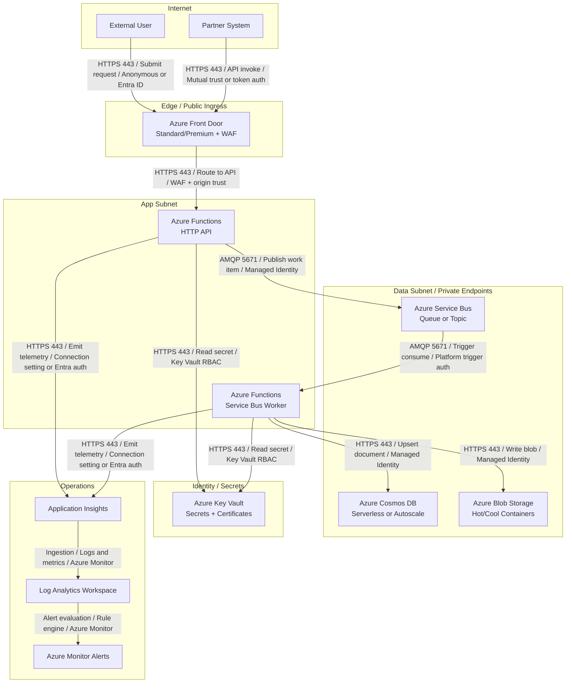

# Architecture Diagramming Skill

## Purpose

Produce a valid Mermaid diagram that shows the Azure target architecture exactly as described in the design document: resources, trust boundaries, data flow, ingress, egress, and authentication on every connection.

## When to Use

- After `design-document.md` Sections 3 and 4 are complete
- Before finalizing Phase 2 architecture outputs
- When validation reveals a mismatch between prose and topology
- When an updated design requires a refreshed Mermaid file

## Inputs

| Path | Why it matters |
|---|---|
| `outputs/azure-architecture-output/design-document.md` | Source of truth for services, boundaries, and flows |
| `outputs/aws-migration-artifacts/architecture-diagram.mmd` | Current-state reference when preserving important flows |
| `outputs/aws-migration-artifacts/dependency-matrix.csv` | Dependency verification |

## Outputs

| Path | Result |
|---|---|
| `outputs/azure-architecture-output/architecture-diagram-azure.mmd` | Valid Mermaid diagram ready for downstream use |

## Process

1. Read `design-document.md` Sections 3, 4, 7, and 8 before drawing anything.
2. Inventory every Azure resource that must appear.
3. Decide whether `graph TD` or `graph LR` is clearest; default to `graph TD`.
4. Group resources into subgraphs that reflect network and trust boundaries.
5. Add nodes using stable IDs and readable labels.
6. Label every edge with both protocol and authentication or trust mode.
7. Validate the draft with the Mermaid validator before saving the final file.

## Required subgraph groupings

Use these boundaries unless the design document explicitly requires a different topology:

| Subgraph | What belongs inside |
|---|---|
| `Internet` | End users, partner systems, public clients |
| `Edge` | Azure Front Door, WAF, CDN-facing ingress |
| `App Subnet` | Azure Functions, app-level compute, integration components |
| `Data Subnet` | Private endpoints, Cosmos DB, PostgreSQL, Storage, Service Bus private links |
| `Operations` | Application Insights, Log Analytics, dashboards, alerts |
| `Identity / Secrets` | Key Vault and related secret/certificate resources |

## Labeling conventions

Apply these conventions consistently:

- Node IDs are uppercase snake case or short stable IDs such as `FD`, `FUNC_HTTP`, `SB`, `COSMOS`.
- Node labels show resource type first, then workload role, then major SKU or tier.
- Every edge label includes:
  1. protocol or port
  2. action or data flow
  3. auth or trust mode

**Examples**

- `USER -->|"HTTPS 443 / Submit upload / Anonymous or Entra ID"| FD`
- `FD -->|"HTTPS 443 / Origin route / WAF + origin trust"| FUNC_HTTP`
- `FUNC_HTTP -->|"AMQP 5671 / Publish event / Managed Identity"| SB`
- `FUNC_WORKER -->|"HTTPS 443 / Upsert document / Managed Identity"| COSMOS`
- `FUNC_HTTP -->|"HTTPS 443 / Read secret / Key Vault RBAC"| KV`

## Complete Mermaid template

Use and adapt this structure when the target architecture includes Front Door, Functions, Service Bus, Cosmos DB, Blob Storage, Key Vault, and observability resources:

## Common Mermaid syntax pitfalls

- **Duplicate node IDs:** Mermaid merges duplicate IDs silently; use unique IDs.
- **Unquoted labels with special characters:** quote labels that contain parentheses, colons, slashes, or ` `.
- **Edge labels with unescaped pipes:** only the outer `|...|` pair is allowed.
- **Comments inserted mid-edge:** comments between a node and its arrow often break parsing.
- **Mixed indentation in subgraphs:** keep indentation consistent for readability and fewer validator surprises.
- **Missing `end` for a subgraph:** Mermaid may report unrelated line errors when an `end` is missing.
- **Overloaded single node labels:** if a node label becomes a paragraph, split the component into multiple nodes.

## Validation steps with `mermaid-diagram-validator`

1. Draft the diagram in memory or in the target file.
2. Run the `mermaid-diagram-validator` tool against the full diagram text.
3. Fix any parse errors first.
4. Re-run the validator until it reports success.
5. Perform a semantic pass:
   - every resource in `design-document.md` Section 3 appears
   - every boundary in Section 8 appears as a subgraph where applicable
   - every edge has protocol and auth or trust context
6. Save the validated diagram to `outputs/azure-architecture-output/architecture-diagram-azure.mmd`.
7. If the validator is unavailable, use Mermaid Live as a secondary syntax check and note the limitation.

## Edge Cases / Failure Modes

- **Internal-only workload:** replace `Internet` and `Edge` with private ingress or internal app gateway boundaries if the design says there is no public entry point.
- **No async path:** if Service Bus is not part of the architecture, remove the queue path rather than leaving a placeholder.
- **Shared services across regions:** show region or subscription boundaries clearly in subgraph titles.
- **Private endpoints omitted from prose:** add them only if the design document or service rules require them; otherwise request a design correction.
- **Overcrowded diagram:** split out secondary flows into supporting references only if the main Mermaid file still preserves the authoritative topology.

## Rules

- **Every resource in `design-document.md` Section 3 must appear in the diagram.**
- **Every trust or network boundary must be represented by a subgraph or a clearly named node.**
- **Every edge must include protocol plus auth or trust mode.**
- **Do not invent resources not supported by the design document.**
- **Do not ship a Mermaid file that has not passed validation.**

## Best Practices

- Keep labels reviewer-friendly: resource type first, workload role second.
- Draw the primary request path from top to bottom so non-authors can follow it quickly.
- Use one node per operationally distinct component even if Azure exposes several features inside one service.
- Keep the diagram aligned with the prose in Section 4 and the controls in Sections 7 and 8.
- Prefer clarity over icon density; Mermaid is a communication artifact, not a pixel-perfect architecture poster.

---

## References

### Microsoft / Azure Documentation

| Topic | Link |
|---|---|
| Azure architecture icons | https://learn.microsoft.com/en-us/azure/architecture/icons/ |
| Azure architecture diagrams guidance | https://learn.microsoft.com/en-us/azure/architecture/guide/design-principles/ |
| Azure Virtual Network topology | https://learn.microsoft.com/en-us/azure/virtual-network/virtual-networks-overview |
| Hub-spoke network topology | https://learn.microsoft.com/en-us/azure/architecture/networking/architecture/hub-spoke |
| Private endpoint network topology | https://learn.microsoft.com/en-us/azure/private-link/private-endpoint-overview |
| Azure Front Door overview | https://learn.microsoft.com/en-us/azure/frontdoor/front-door-overview |

### Mermaid Documentation

| Topic | Link |
|---|---|
| Mermaid graph diagrams | https://mermaid.js.org/syntax/flowchart.html |
| Mermaid subgraphs | https://mermaid.js.org/syntax/flowchart.html#subgraphs |
| Mermaid live editor (for validation) | https://mermaid.live |

### Best Practices

- **Validate early** — syntax errors compound quickly once the diagram grows.
- **Show auth on edges** — architecture reviewers need to see where trust decisions happen.
- **Treat subgraphs as boundary contracts** — they communicate more than visual grouping.
- **Keep the file authoritative** — if the prose and diagram differ, downstream agents will implement the wrong thing.
